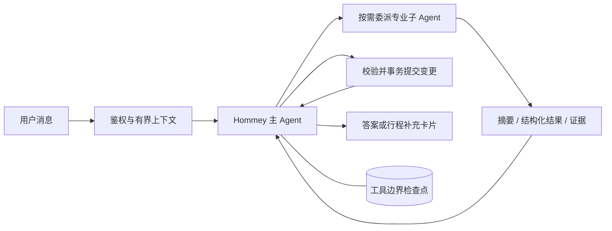

<p align="center">
  
</p>

<h1 align="center">Hommey</h1>

<p align="center">
  <strong>出发前，问问 Hommey。</strong><br>
  <sub>路线、标准和细节，她陪你一次理清。</sub>
</p>

<p align="center">
  
  
  
  
  
</p>

<p align="center">
  <a href="#认识-hommey">产品一览</a> ·
  <a href="#hommey-解决什么问题">核心能力</a> ·
  <a href="#编排是怎样工作的">系统设计</a> ·
  <a href="#快速开始">快速开始</a>
</p>

Hommey 是一位面向企业差旅的 AI 助手。她在同一段对话里理解行程、查找公司制度与目的地信息，再把零散条件整理成可以继续追问、可以实际执行的差旅方案。每一条制度结论都保留证据来源，尚未完成的任务也能在中断后继续。

> Hommey 提供规划与报销准备建议，不代替用户完成预订、付款、审批或报销提交。

## 认识 Hommey

<p align="center">
  
</p>

<p align="center">
  <sub>一个安静、直接的对话入口。说出目的地，剩下的线索由她接住。</sub>
</p>

## 她把复杂留在背后

不需要先读制度，也不需要在多个页面之间拼凑答案。告诉 Hommey 你已经知道的部分，她会补齐必要信息，并把不同来源整理成清楚、可信的结果。

<table>
  <tr>
    <td width="50%" valign="top">
      
      <br><br>
      <strong>读懂公司的差旅标准</strong><br>
      <sub>从内部知识库提取适用条款，保留文字版、来源与更新时间，让每个结论都有依据。</sub>
    </td>
    <td width="50%" valign="top">
      
      <br><br>
      <strong>把外部信息带回当前行程</strong><br>
      <sub>天气与公共交通独立查询、结构化呈现，不让动态信息混入公司的制度依据。</sub>
    </td>
  </tr>
</table>

<p align="center">
  
</p>

<p align="center">
  <strong>最后，给你一份真正能执行的答案。</strong><br>
  <sub>交通、住宿、日程与合规提示被放进同一张卡片；细节按需展开，重要信息始终在前。</sub>
</p>

## Hommey 解决什么问题

| 场景 | Hommey 的处理方式 |
| --- | --- |
| 信息不完整 | 保存当前行程，生成可交互的补全卡片，补齐后自动续跑原任务 |
| 一个问题包含多个意图 | 将天气、制度、规划等意图拆成边界明确的独立任务，按依赖关系执行 |
| 制度与外部信息混在一起 | 公司制度只进入内部 RAG；天气与公共交通只进入外部信息查询，避免 Query 串扰 |
| 用户主动终止 | 取消当前执行并保留检查点；同一请求 ID 可恢复，新一轮通过工作摘要继续 |
| 重复提交或并发请求 | 请求幂等、事务回执、版本校验和用户级锁保护写入 |
| 长对话与跨会话使用 | Redis 保存短期上下文，PostgreSQL 保存会话、行程和用户差旅偏好 |

## 编排是怎样工作的



主 Agent 决定调用谁、传哪些结果、何时补问和结束。六类专业子 Agent 分别负责行程整理、
制度 RAG、个人记忆、出行信息、方案规划和合规检查。独立查询可并发，有依赖的任务显式传入
已完成结果。子 Agent 不继承主对话和兄弟日志，也不能继续创建 Agent。

| 实现 | 职责 |
| --- | --- |
| `agent_runtime/engine.py` | 主/子原生工具循环、调度与恢复 |
| `agent_runtime/profiles.py` | 六角色与实际权限边界 |
| `agent_runtime/services.py` | 上下文和受控业务查询 |
| `agent_runtime/validation.py` | 来源、字段和原文依据校验 |
| `agent_runtime/store.py` | PostgreSQL 检查点、版本校验和幂等写入 |
| `agent_runtime/render.py` | 结果到前端文档 |

运行器只有这一套。旧意图 Agent、DAG、动态 Skill 执行器及 Composer 已删除，回滚使用 Git
检查点。Skill 是按需读取的业务指南，不能扩展权限或动态加载代码。
完整边界和验证范围见 [架构与回滚](docs/plans/2026-09-08-supervisor-implementation-and-rollback.md)。

## 内置能力

仓库内的能力以标准 Skill 包维护，入口位于 `.agents/skills/<skill-name>/SKILL.md`。

| Skill | 用途 |
| --- | --- |
| `event-collection` | 增量收集当前公司出差事项 |
| `ask-question` | 基于内部知识库回答差旅制度问题 |
| `query-info` | 查询天气和公共交通信息（无需完整差旅上下文） |
| `train-query` | 查询真实车票/车次、时刻、历时与余票（无需完整差旅上下文） |
| `plan-trip` | 组合事项、制度与外部信息生成行程 |
| `check-trip-compliance` | 根据已检索的制度证据检查合规性 |
| `memory-query` | 查询当前用户自己的差旅记录 |
| `preference` | 保存酒店、航司、座位等差旅偏好 |
| `place-query` | 工作地点定位和附近酒店信息，供出行信息角色使用 |

Skill 保存业务方法和展示元数据；工具权限和执行契约由运行器代码校验，管理员目录只读。详细说明见 [Skill 系统](docs/skill-system.md)。

## 技术组成

| 层 | 实现 |
| --- | --- |
| Web | FastAPI、Uvicorn、Jinja2、原生 JavaScript 与 CSS |
| Agent | AgentScope 模型适配器、Supervisor 原生工具循环、六个专业角色 |
| 状态与记忆 | PostgreSQL 16、Redis 7 |
| 检索 | PostgreSQL + pgvector、BM25、RRF、BGE Embedding |
| 传输 | NDJSON 流式响应 |
| 部署 | Docker Compose |

前端没有 Node 构建步骤，修改模板、JavaScript 或 CSS 后可直接通过开发挂载验证。

## 快速开始

### 1. 准备配置

```bash
cp .env.example .env
```

至少配置模型 API、JWT 密钥和数据库密码：

```bash
HOMMEY_API_KEY=your-api-key
HOMMEY_MODEL_NAME=your-model
HOMMEY_BASE_URL=https://your-openai-compatible-endpoint/v1
HOMMEY_JWT_SECRET=replace-with-a-long-random-secret
PG_PASSWORD=replace-with-a-postgres-password
```

RAG 默认使用云端 BGE Embedding，相关配置已经列在 `.env.example` 中。

### 2. 启动

开发环境使用基础 Compose 文件和源码挂载覆盖：

```bash
docker compose \
  -f docker/docker-compose.yml \
  -f docker/docker-compose.dev.yml \
  up -d
```

确认服务及依赖已经就绪：

```bash
curl http://127.0.0.1:8000/readyz
```

打开 `http://127.0.0.1:8000`，注册账号后即可开始对话。管理员邮箱可通过 `HOMMEY_ADMIN_EMAILS` 配置。

Compose 默认启动两个 Uvicorn worker，并另启 `rag-worker` 处理 PostgreSQL 中的持久化知识库刷新任务。当前知识库和附件目录通过同一主机的持久卷共享；部署到多台主机或多个云实例前，需要实现对象存储适配并将 `HOMMEY_RAG_SOURCE_STORAGE` 切换为 `object_storage`。

> Docker 容器中的 `localhost` 指向容器本身。PostgreSQL 和 Redis 地址应使用 Compose 服务名；默认配置已经处理这一点。

## 项目结构

```text
.agents/skills/          业务指南与展示元数据
agent_runtime/          统一主/子 Agent、上下文、工具、校验和检查点
core/integrations/      天气、地图、12306 适配器
core/presentation/       行程补全卡片和答案文档协议
context/                 会话、记忆、偏好与 PostgreSQL 仓储
rag/                     内部制度的混合检索
webui_new/               FastAPI 路由、鉴权、页面与静态资源
docker/                  镜像与 Compose 配置
tests/                   单元、契约与集成测试
docs/                    设计说明和变更记录
```

## 测试

运行完整测试：

```bash
docker compose \
  -f docker/docker-compose.yml \
  -f docker/docker-compose.dev.yml \
  exec hommey pytest -q
```

六角色流程、上下文隔离、终止恢复、并发幂等和卡片有独立回归用例。完整集成测试需要独立 PostgreSQL 和 Redis；离线命令与已知限制见架构文档。

## 进一步阅读

| 文档 | 内容 |
| --- | --- |
| [架构与回滚](docs/plans/2026-09-08-supervisor-implementation-and-rollback.md) | 单一 Supervisor、上下文、六角色和回滚检查点 |
| [Skill 系统](docs/skill-system.md) | Skill 包结构、加载、治理与观测 |
| [记忆系统](docs/memory-system.md) | 短期上下文、长期记忆与隐私边界 |
| [行程收集体验](docs/trip-intake-experience.md) | 缺失信息收集和自动续跑 |
| [错误契约](docs/error-codes.md) | API 错误码和可观测性字段 |
| [项目结构](docs/project-structure.md) | 模块边界与目录说明 |

## License

仓库当前尚未包含 LICENSE 文件。若计划公开分发或接受外部贡献，请先明确许可协议。
