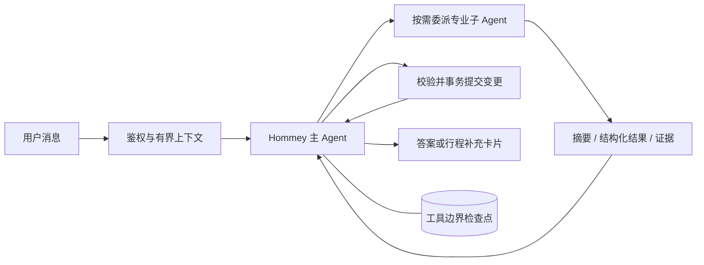

<p align="center">
  
</p>

<h1 align="center">Hommey</h1>

<p align="center"><sub>面向企业差旅的 AI 助手 · 出发前，问问 Hommey。</sub></p>

---

Hommey 在一个对话里完成差旅规划：理解你的行程，检索公司制度与目的地信息，把零散条件整理成可以继续追问、也可以直接执行的方案。

它把两件事分得很开——**公司制度只进入内部知识库检索，天气、车次、地图只走外部查询**，两者不会互相污染。每一条制度结论都带原文出处；信息不全时先存下行程、生成补全卡片，补齐后自动接着原来的任务跑，不用从头再说一遍。

> Hommey 提供规划与报销准备建议，不代替用户完成预订、付款、审批或报销提交。


## 处理哪些情况

| 情况 | 处理方式 |
| --- | --- |
| 信息不完整 | 保存当前行程，生成可交互的补全卡片，补齐后自动续跑原任务 |
| 一句话包含多个意图 | 拆成边界明确的独立任务，无依赖的并发执行，有依赖的显式传入结果 |
| 制度与外部信息混在一起 | 内部 RAG 与外部查询各自独立，避免 Query 串扰 |
| 用户主动终止 | 取消执行并保留检查点；同一请求 ID 可恢复，新一轮靠工作摘要继续 |
| 重复提交或并发请求 | 请求幂等、事务回执、版本校验；写入按会话互斥 |
| 长对话与跨会话 | 短期上下文放 Redis，会话、行程与用户偏好落 PostgreSQL |

<table>
  <tr>
    <td width="50%" valign="top">
      
      <br><br>
      <strong>读懂公司的差旅标准</strong><br>
      <sub>从内部知识库提取适用条款，保留文字版、来源与更新时间。</sub>
    </td>
    <td width="50%" valign="top">
      
      <br><br>
      <strong>把外部信息带回当前行程</strong><br>
      <sub>天气与公共交通独立查询、结构化呈现，不混入制度依据。</sub>
    </td>
  </tr>
</table>


交通、住宿、日程与合规提示在同一张卡片里；细节按需展开。

## 编排



主 Agent 决定调用谁、传哪些结果、何时补问和结束。六类专业子 Agent 分别负责行程整理、制度 RAG、个人记忆、出行信息、方案规划和合规检查。子 Agent 不继承主对话和兄弟日志，也不能继续创建 Agent。

| 实现 | 职责 |
| --- | --- |
| `agent_runtime/engine.py` | 主/子原生工具循环、调度与恢复 |
| `agent_runtime/profiles.py` | 六角色与实际权限边界 |
| `agent_runtime/services.py` | 上下文和受控业务查询 |
| `agent_runtime/validation.py` | 来源、字段和原文依据校验 |
| `agent_runtime/store.py` | PostgreSQL 检查点、版本校验和幂等写入 |
| `agent_runtime/render.py` | 结果到前端文档 |

运行器只有这一套。旧意图 Agent、DAG、动态 Skill 执行器及 Composer 已删除，回滚使用 Git 检查点。Skill 是按需读取的业务指南，不能扩展权限或动态加载代码。完整边界见[架构与回滚](docs/plans/2026-09-08-supervisor-implementation-and-rollback.md)。

### 按会话隔离

并发边界划在**会话**上，不在用户上——同一用户的不同会话可以同时生成，同一会话内则串行。为此 `HommeyWebInstance` 不保存"当前会话"，`MemoryManager.for_session` 为每个请求构造独立的绑定视图，只隔离会话、缓存与请求标识，连接池和用户偏好保持共享。同一会话的并发写入立即返回 `SESSION_BUSY` 而不是排队。

## 内置能力

能力以标准 Skill 包维护，入口位于 `.agents/skills/<skill-name>/SKILL.md`。

| Skill | 用途 |
| --- | --- |
| `event-collection` | 增量收集当前公司出差事项 |
| `ask-question` | 基于内部知识库回答差旅制度问题 |
| `query-info` | 查询天气和公共交通（无需完整差旅上下文） |
| `train-query` | 查询真实车票/车次、时刻、历时与余票 |
| `plan-trip` | 组合事项、制度与外部信息生成行程 |
| `check-trip-compliance` | 根据已检索的制度证据检查合规性 |
| `memory-query` | 查询当前用户自己的差旅记录 |
| `preference` | 保存酒店、航司、座位等差旅偏好 |
| `place-query` | 工作地点定位和附近酒店信息 |

Skill 保存业务方法和展示元数据；工具权限与执行契约由运行器代码校验，管理员目录只读。详见 [Skill 系统](docs/skill-system.md)。

## 技术组成

| 层 | 实现 |
| --- | --- |
| Web | FastAPI、Uvicorn、Jinja2、原生 JavaScript 与 CSS |
| Agent | AgentScope 模型适配器、Supervisor 原生工具循环、六个专业角色 |
| 状态与记忆 | PostgreSQL 16、Redis 7 |
| 检索 | PostgreSQL + pgvector、BM25、RRF、BGE Embedding |
| 多模态 | 附件解析与语音输入 |
| 扩展 | MCP 配置与管理 |
| 评估 | 逐轮采集与判定 |
| 传输 | NDJSON 流式响应 |
| 部署 | Docker Compose |

前端没有 Node 构建步骤，改动模板、JavaScript 或 CSS 后可直接通过开发挂载验证。

## 快速开始

需要 Docker 与 Docker Compose。另外要准备好一个 OpenAI 兼容的模型端点，RAG 默认使用云端 BGE Embedding。

```bash
cp .env.example .env
```

至少配置模型、JWT 密钥和数据库密码：

```bash
HOMMEY_API_KEY=your-api-key
HOMMEY_MODEL_NAME=your-model
HOMMEY_BASE_URL=https://your-openai-compatible-endpoint/v1
HOMMEY_JWT_SECRET=replace-with-a-long-random-secret
PG_PASSWORD=replace-with-a-postgres-password
```

启动（开发环境在基础 Compose 之上挂载源码）：

```bash
docker compose \
  -f docker/docker-compose.yml \
  -f docker/docker-compose.dev.yml \
  up -d

curl http://127.0.0.1:8000/readyz
```

打开 `http://127.0.0.1:8000`，注册后即可对话。管理员邮箱通过 `HOMMEY_ADMIN_EMAILS` 配置。

Compose 默认起两个 Uvicorn worker，并另起 `rag-worker` 处理 PostgreSQL 中的知识库刷新任务。当前知识库与附件目录通过同一主机的持久卷共享；部署到多主机前需要实现对象存储适配，并把 `HOMMEY_RAG_SOURCE_STORAGE` 切到 `object_storage`。

> 容器里的 `localhost` 指向容器自身。PostgreSQL 和 Redis 地址要写 Compose 服务名，默认配置已经处理。

## 项目结构

```text
.agents/skills/      业务指南与展示元数据
agent_runtime/       主/子 Agent、上下文、工具、校验与检查点
context/             会话、记忆、偏好与 PostgreSQL 仓储
core/integrations/   天气、地图、12306 适配器
core/presentation/   补全卡片与答案文档协议
rag/                 内部制度的混合检索
multimodal/          附件与语音输入
hommey_mcp/          MCP 配置与管理
evaluation/          逐轮采集与判定
webui_new/           FastAPI 路由、鉴权、页面与静态资源
utils/               熔断、IO 执行器、日志安全
scripts/             运维与验证脚本
docker/              镜像与 Compose 配置
tests/               单元、契约与集成测试
docs/                设计说明与变更记录
```

## 测试

```bash
docker compose \
  -f docker/docker-compose.yml \
  -f docker/docker-compose.dev.yml \
  exec hommey pytest -q
```

六角色流程、上下文隔离、终止恢复、并发幂等和卡片各有回归用例。并发与会话隔离部分需要独立的 PostgreSQL 和 Redis——`docker/docker-compose.test.yml` 提供了一套隔离实例（55432 / 56379），不会碰业务库。浏览器验收脚本在 `tests/check_*_ui.py` 与 `scripts/` 下。

## 项目状态

仍在持续开发。业务容器尚未做过完整的真实模型验收；部分验证用可控替身代替模型阶段，已在对应文档中标注。仓库当前没有 LICENSE 文件，若计划公开分发或接受外部贡献，需要先明确许可协议。

## 进一步阅读

| 文档 | 内容 |
| --- | --- |
| [架构与回滚](docs/plans/2026-09-08-supervisor-implementation-and-rollback.md) | 单一 Supervisor、上下文、六角色和回滚检查点 |
| [Skill 系统](docs/skill-system.md) | Skill 包结构、加载、治理与观测 |
| [记忆系统](docs/memory-system.md) | 短期上下文、长期记忆与隐私边界 |
| [行程收集体验](docs/trip-intake-experience.md) | 缺失信息收集和自动续跑 |
| [错误契约](docs/error-codes.md) | API 错误码和可观测性字段 |
| [项目结构](docs/project-structure.md) | 模块边界与目录说明 |
| [缺陷记录](docs/bugs/README.md) | 已复现问题的根因与修复范围 |
