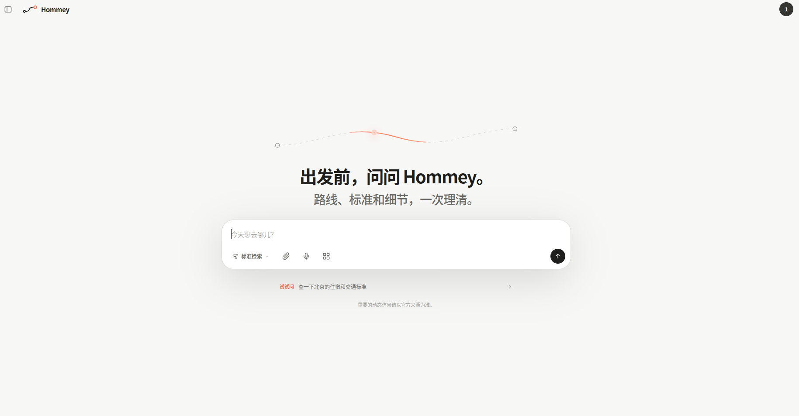
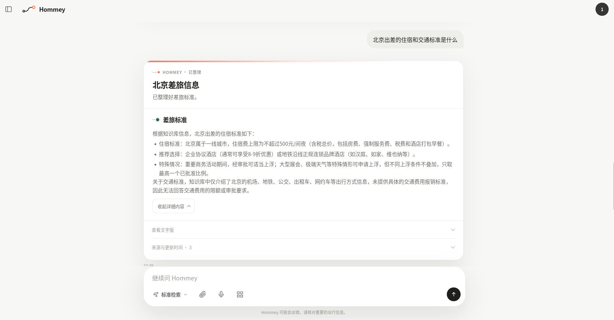
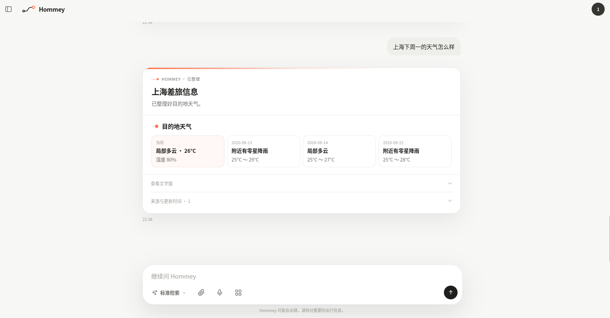
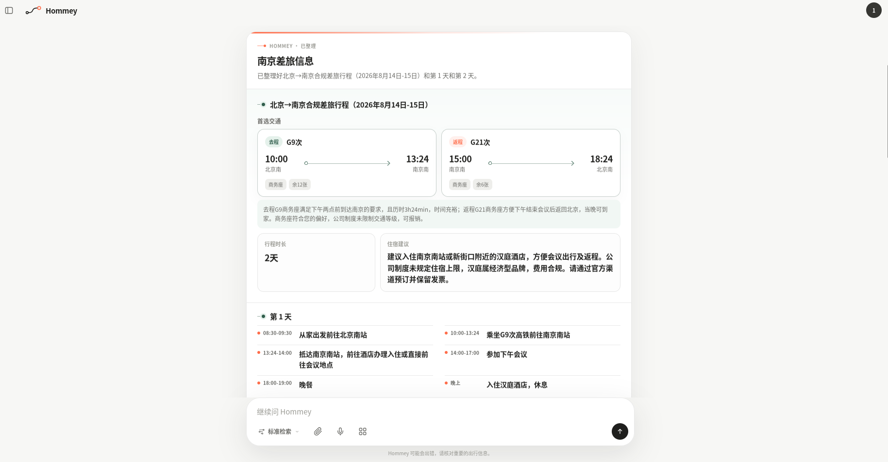
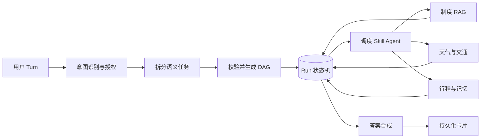

<p align="center">
  
</p>

<h1 align="center">Hommey</h1>

<p align="center">
  <strong>出发前，问问 Hommey。</strong><br>
  <sub>路线、标准和细节，她陪你一次理清。</sub>
</p>

<p align="center">
  
  
  
  
  
</p>

<p align="center">
  <a href="#认识-hommey">产品一览</a> ·
  <a href="#hommey-解决什么问题">核心能力</a> ·
  <a href="#编排是怎样工作的">系统设计</a> ·
  <a href="#快速开始">快速开始</a>
</p>

Hommey 是一位面向企业差旅的 AI 助手。她在同一段对话里理解行程、查找公司制度与目的地信息，再把零散条件整理成可以继续追问、可以实际执行的差旅方案。每一条制度结论都保留证据来源，尚未完成的任务也能在中断后继续。

> Hommey 提供规划与报销准备建议，不代替用户完成预订、付款、审批或报销提交。

## 认识 Hommey

<p align="center">
  
</p>

<p align="center">
  <sub>一个安静、直接的对话入口。说出目的地，剩下的线索由她接住。</sub>
</p>

## 她把复杂留在背后

不需要先读制度，也不需要在多个页面之间拼凑答案。告诉 Hommey 你已经知道的部分，她会补齐必要信息，并把不同来源整理成清楚、可信的结果。

<table>
  <tr>
    <td width="50%" valign="top">
      
      <br><br>
      <strong>读懂公司的差旅标准</strong><br>
      <sub>从内部知识库提取适用条款，保留文字版、来源与更新时间，让每个结论都有依据。</sub>
    </td>
    <td width="50%" valign="top">
      
      <br><br>
      <strong>把外部信息带回当前行程</strong><br>
      <sub>天气与公共交通独立查询、结构化呈现，不让动态信息混入公司的制度依据。</sub>
    </td>
  </tr>
</table>

<p align="center">
  
</p>

<p align="center">
  <strong>最后，给你一份真正能执行的答案。</strong><br>
  <sub>交通、住宿、日程与合规提示被放进同一张卡片；细节按需展开，重要信息始终在前。</sub>
</p>

## Hommey 解决什么问题

| 场景 | Hommey 的处理方式 |
| --- | --- |
| 信息不完整 | 保存当前行程，生成可交互的补全卡片，补齐后自动续跑原任务 |
| 一个问题包含多个意图 | 将天气、制度、规划等意图拆成边界明确的独立任务，按依赖关系执行 |
| 制度与外部信息混在一起 | 公司制度只进入内部 RAG；天气与公共交通只进入外部信息查询，避免 Query 串扰 |
| 用户主动终止 | 持久化 Run、Turn、Goal 和 Node 状态；再次表达“继续”时恢复未完成节点 |
| 重复提交或并发请求 | 使用请求幂等、节点 `operation_id`、状态 `revision` 和用户级锁避免重复执行 |
| 长对话与跨会话使用 | Redis 保存短期上下文，PostgreSQL 保存会话、行程和用户差旅偏好 |

## 编排是怎样工作的



职责边界保持明确：意图 Agent 只识别和授权；任务分解器产出隔离后的语义任务；编排层创建并维护状态机；子 Agent 只提交执行结果，不直接修改全局状态；Composer 最后生成统一的答案文档。

| 阶段 | 主要实现 |
| --- | --- |
| 意图识别 | `agents/intention_agent.py` |
| 任务计划 | `core/orchestration/decomposer.py` |
| 计划校验与依赖图 | `core/orchestration/validator.py`、`graph_builder.py` |
| 运行与恢复 | `core/orchestration/pipeline.py`、`lifecycle.py` |
| 状态持久化 | `core/orchestration/state.py`、`state_store.py` |
| 节点执行 | `core/orchestration/executor.py` |
| 答案合成 | `core/orchestration/composer.py` |

### 状态模型

编排状态的权威快照是 PostgreSQL 中的 JSONB。它不是一段任意 JSON，而是由 Pydantic 模型约束的版本化结构：

```text
Run       一次可暂停、可恢复的完整工作流
└─ Turn   用户的一次输入或一次继续操作
   └─ Goal   一个独立业务意图，例如查制度或规划行程
      └─ Node   DAG 中可实际执行和重试的步骤
```

每次影响恢复语义的状态变更都会持久化，并通过 `revision` 做并发冲突检测。过程中的展示事件仍使用流式传输，不会把每一个 UI 进度字样都写入数据库。快速路由只处理没有上下文依赖的安全请求；存在待补充或可恢复 Run 时，输入会先交给 Turn Resolver 判断是继续、修订还是新任务。

更完整的设计见 [任务编排 v2](docs/task-orchestration-v2.md) 和 [行程收集体验](docs/trip-intake-experience.md)。

## 内置能力

仓库内的能力以标准 Skill 包维护，入口位于 `.agents/skills/<skill-name>/SKILL.md`。

| Skill | 用途 |
| --- | --- |
| `event-collection` | 增量收集当前公司出差事项 |
| `ask-question` | 基于内部知识库回答差旅制度问题 |
| `query-info` | 查询天气和公共交通信息（无需完整差旅上下文） |
| `train-query` | 查询真实车票/车次、时刻、历时与余票（无需完整差旅上下文） |
| `plan-trip` | 组合事项、制度与外部信息生成行程 |
| `check-trip-compliance` | 根据已检索的制度证据检查合规性 |
| `memory-query` | 查询当前用户自己的差旅记录 |
| `preference` | 保存酒店、航司、座位等差旅偏好 |
| `chitchat` | 处理简短问候和能力说明 |
| `mcp-tool` | 路由已经明确授权的 MCP 调用，默认停用 |

Skill 可以独立声明输入输出、风险、依赖和执行步骤，并由平台统一发现、校验、启停和记录执行轨迹。详细说明见 [Skill 系统](docs/skill-system.md)。

## 技术组成

| 层 | 实现 |
| --- | --- |
| Web | FastAPI、Uvicorn、Jinja2、原生 JavaScript 与 CSS |
| Agent | AgentScope、自研多意图编排流水线、声明式 Skill |
| 状态与记忆 | PostgreSQL 16、Redis 7 |
| 检索 | PostgreSQL + pgvector、BM25、RRF、BGE Embedding |
| 传输 | NDJSON 流式响应 |
| 部署 | Docker Compose |

前端没有 Node 构建步骤，修改模板、JavaScript 或 CSS 后可直接通过开发挂载验证。

## 快速开始

### 1. 准备配置

```bash
cp .env.example .env
```

至少配置模型 API、JWT 密钥和数据库密码：

```bash
HOMMEY_API_KEY=your-api-key
HOMMEY_MODEL_NAME=your-model
HOMMEY_BASE_URL=https://your-openai-compatible-endpoint/v1
HOMMEY_JWT_SECRET=replace-with-a-long-random-secret
PG_PASSWORD=replace-with-a-postgres-password
```

RAG 默认使用云端 BGE Embedding，相关配置已经列在 `.env.example` 中。

### 2. 启动

开发环境使用基础 Compose 文件和源码挂载覆盖：

```bash
docker compose \
  -f docker/docker-compose.yml \
  -f docker/docker-compose.dev.yml \
  up -d
```

确认服务及依赖已经就绪：

```bash
curl http://127.0.0.1:8000/readyz
```

打开 `http://127.0.0.1:8000`，注册账号后即可开始对话。管理员邮箱可通过 `HOMMEY_ADMIN_EMAILS` 配置。

Compose 默认启动两个 Uvicorn worker，并另启 `rag-worker` 处理 PostgreSQL 中的持久化知识库刷新任务。当前知识库和附件目录通过同一主机的持久卷共享；部署到多台主机或多个云实例前，需要实现对象存储适配并将 `HOMMEY_RAG_SOURCE_STORAGE` 切换为 `object_storage`。

> Docker 容器中的 `localhost` 指向容器本身。PostgreSQL 和 Redis 地址应使用 Compose 服务名；默认配置已经处理这一点。

## 项目结构

```text
.agents/skills/          业务 Skill 包及其契约
agents/                  意图识别与 Agent 适配层
core/orchestration/      任务拆分、DAG、执行、状态与合成
core/presentation/       行程补全卡片和答案文档协议
context/                 会话、记忆、偏好与 PostgreSQL 仓储
rag/                     内部制度的混合检索
webui_new/               FastAPI 路由、鉴权、页面与静态资源
docker/                  镜像与 Compose 配置
tests/                   单元、契约与集成测试
docs/                    设计说明和变更记录
```

## 测试

运行完整测试：

```bash
docker compose \
  -f docker/docker-compose.yml \
  -f docker/docker-compose.dev.yml \
  exec hommey pytest -q
```

编排状态机、终止恢复、并发幂等和持久化卡片都有独立回归用例。需要真实 PostgreSQL 或 Redis 的测试会根据运行环境自动执行或跳过。

## 进一步阅读

| 文档 | 内容 |
| --- | --- |
| [任务编排 v2](docs/task-orchestration-v2.md) | 多意图拆分、DAG、状态机与恢复流程 |
| [Skill 系统](docs/skill-system.md) | Skill 包结构、加载、治理与观测 |
| [记忆系统](docs/memory-system.md) | 短期上下文、长期记忆与隐私边界 |
| [行程收集体验](docs/trip-intake-experience.md) | 缺失信息收集和自动续跑 |
| [错误契约](docs/error-codes.md) | API 错误码和可观测性字段 |
| [项目结构](docs/project-structure.md) | 模块边界与目录说明 |

## License

仓库当前尚未包含 LICENSE 文件。若计划公开分发或接受外部贡献，请先明确许可协议。
