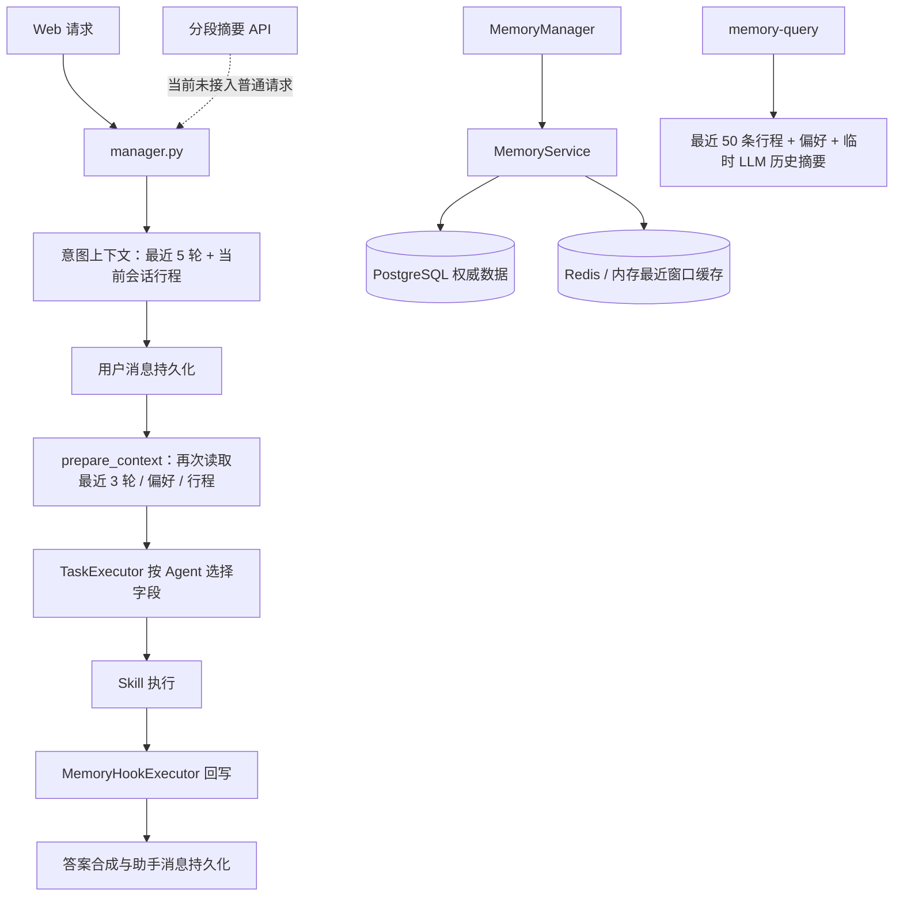
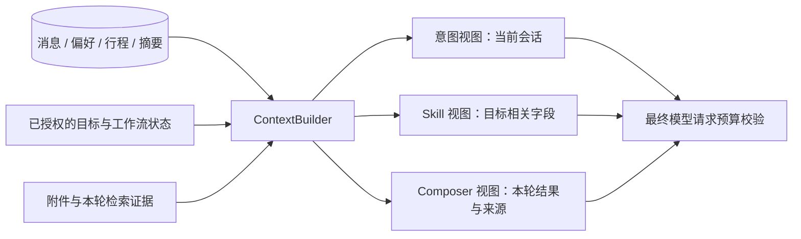

# Hommey 轻量记忆与上下文架构评估、实施计划

日期：2026-09-08。评估基线：`bbab50a` 加当前工作区。本文为待实施建议，不表示已完成重构。

本轮仅阅读代码、核对 OpenClaw 官方文档、运行选定的本地测试，并新增本文。未读取生产聊天数据，未调用业务模型，未修改运行代码、数据库或现有界面文件。

## 1. 结论

当前主要问题是**数据职责与上下文入口没有收口，部分已建能力没有接入生产调用链**。PostgreSQL 事实源、Redis 回源、幂等消息、会话隔离和工作流恢复已经存在，应该保留。

建议采用“持久消息 + 明确的用户偏好 + 会话摘要 + 按需历史查询 + 统一上下文组装”，复用 PostgreSQL 和 Redis。OpenClaw 值得借鉴的是持久记忆与模型上下文分离、记忆可追溯、按预算加载、压缩前保存关键事实。Hommey 是多用户差旅服务，继续用数据库表达这些概念更合适。

首版目标：普通长对话不断片、历史回答可核验、每次模型调用的上下文来源和预算可解释。实现范围以六个小阶段收敛，不继续照旧计划同时铺开画像、事件库、任务库、通用作业系统和向量召回。

## 2. 当前真正运行的链路



快速路由可以跳过意图上下文；工作流有独立的 Run/Turn/Goal/Node 状态与恢复路径。上图描述普通复杂请求，并非所有分支都逐项执行。

### 已有能力与应保留部分

| 能力 | 代码证据 | 判断 |
| --- | --- | --- |
| PostgreSQL 消息、会话事实源 | `context/memory_service.py:119`、`context/memory_repository.py` | 保留，避免重做存储 |
| Redis 故障回源与缓存校验 | `context/memory_service.py:173` | 已实现，Redis 不是唯一记忆 |
| 共享数据库连接池 | `context/postgres_pool.py:17` | 已实现，旧文档的“每用户一条连接”描述已过时 |
| 会话级行程隔离 | `context/memory_manager.py:156`、迁移 `0019` | 保留；不要恢复成每用户一个全局当前行程 |
| 子任务最小上下文 | `core/orchestration/executor.py:243` | 保留隔离规则，统一入口不意味着所有 Agent 共享全部记忆 |
| 消息幂等和编排恢复 | MemoryRepository、`core/orchestration/state_store.py` | 保留；摘要不能代替状态机 |
| 脱敏与不可信数据边界 | `utils/memory_safety.py` | 纳入统一入口与写入边界 |

### 已确认的问题

| 优先级 | 发现与证据 | 影响 |
| --- | --- | --- |
| P1 | `_build_context()` 仅读取最近 5 轮和当前行程，未读取当前会话摘要；分段摘要方法在现行应用/Skill 中没有调用方。见 `webui_new/manager.py:1184`、`context/memory_manager.py:384` | 早期约束离开最近窗口后，普通对话没有摘要接力 |
| P1 | `claim_summary_range()` 先提交水位，模型调用后才插入摘要；失败明确不重试。见 `context/memory_repository.py:584`、`context/memory_manager.py:432` | 摘要覆盖出现永久空档；原文仍在，但当前摘要机制不会自动补齐 |
| P1 | `_previous_segment_text()` 用 `limit=1` 取“上一段”，SQL 却按 `created_at ASC LIMIT 1`。见 `context/memory_manager.py:482`、`context/memory_repository.py:730` | 有多段时实际拿到最早一段，摘要链前后文不正确 |
| P1 | `memory-query` 读取最近 50 条行程，并调用另一套历史摘要，最多取最近 30 条聊天。见 `.agents/skills/memory-query/script/agent.py:100` | 更早的目标记录容易漏查；通常先总结再回答，多一次模型调用；返回来源只有数量/布尔值 |
| P1 | 行程规划成功触发 `complete_trip`，保存历史并将 active trip 标记 completed。见 `core/orchestration/memory_hooks.py:119`、`.agents/skills/plan-trip/hommey.yaml` | “方案已生成”和“真实出行已完成”混用，历史查询容易将计划解释成去过的地方；后续修改也失去 active trip |
| P2 | Web、Orchestrator、memory-query 各自读取并组装数据，附件另有字符预算 | 同一请求读到的上下文时间点不同、重复读取，缺少完整 prompt 的统一预算 |
| P2 | `AsyncMemoryFacade` 已存在，但 Web 直接同步调用 `prepare_context()`；async memory hook 和 memory-query 内也直接执行同步存储调用 | PostgreSQL/Redis I/O 仍可能阻塞事件循环；这是调用路径发现，尚未压测延迟 |
| P2 | 偏好实际读写 `user_travel_preferences` 并镜像 `user_preferences`；版本画像仓库只有定义/初始化，没有生产 propose/resolve 调用 | 三套概念共存，版本画像表存在不等于自动冲突确认已生效 |
| P2 | `summary_data` 保存完整 prompt 与消息副本；原文设置 `retention_until`，本次在记忆相关代码中未找到到期清理执行路径 | 信息重复存储；字段存在不等于保留期已经执行，删除语义还需覆盖衍生数据 |
| P2 | `docs/memory-system.md` 仍描述无 Redis TTL、用户级 active trip、无连接池等旧行为；旧重构计划仍含已不存在的 CLI 入口 | 文档不能直接作为当前实现地图，容易继续叠加兼容层 |

跨会话历史不进入普通意图识别是有意的约束，`tests/test_memory_p0.py:338` 有明确测试。改造只补入**当前会话**摘要；跨会话历史仍需明确的记忆查询或用户选定恢复目标。

## 3. OpenClaw 借鉴范围

| OpenClaw 概念 | Hommey 的轻量对应 |
| --- | --- |
| 精简用户画像、长期记忆和详细日记分开 | 偏好表、行程记录、带来源的会话摘要分别保存；生成可读文本视图 |
| 持久记录与本次模型可见上下文分开 | PostgreSQL 保存事实，ContextBuilder 按需要选择；裁剪不会修改原始记录 |
| memory_search / memory_get | 内部 `search_memory()` / `get_memory_source()`，仅当前用户范围；先结构化查询和关键词检索 |
| Compaction | 用持久摘要替换模型上下文中的较老对话，保留近期完整轮次 |
| 压缩前 memory flush | 先提交明确偏好、行程变化和当前工作流状态，再提交摘要覆盖范围；复用业务结果，不再加一个自由调用工具的 Agent |
| Context 检查能力 | 记录每个片段的来源、token 估计、选入/舍弃原因和摘要水位 |

参考 OpenClaw 官方文档：[Memory](https://docs.openclaw.ai/concepts/memory)、[Context](https://docs.openclaw.ai/concepts/context)、[Compaction](https://docs.openclaw.ai/concepts/compaction)、[Session pruning](https://docs.openclaw.ai/concepts/session-pruning)。其修剪机制与永久压缩是不同操作；这里借鉴职责分离，不复制其 provider 特定触发规则。

首版不增加独立记忆服务、向量数据库、知识图谱、插件式 Context Engine、自动反思/dreaming、每用户 Markdown 文件权威库或通用后台任务平台。现有公司制度 RAG 继续独立，不与个人记忆混库。

## 4. 目标数据职责：四类数据、一个上下文入口

| 数据类别 | 唯一权威位置 | 生命周期与读取规则 |
| --- | --- | --- |
| 会话记录 | `conversation_sessions` / `conversation_messages` | 持久对话身份；原文按照明确的保留期策略处理 |
| 用户偏好 | 首版以 `user_travel_preferences` 为准 | 跨会话、显式表达；当前行程临时选择不自动变成长期偏好 |
| 工作状态 | 行程事实在 `active_trip_contexts`；执行状态在现有 WorkflowRunState | `(user_id, session_id)` 隔离；Node 中是执行快照，不能反向覆盖更新的行程事实 |
| 历史记忆 | `session_summaries` + `trip_history` | 摘要保存连续性与决策，行程记录区分计划/已完成；历史查询返回可核验来源 |

Redis 只缓存可重建的最近消息。`ContextBundle` 是上述数据的请求级投影，不落成第五套权威状态。



### 最小接口与模块

```text
context/
  models.py             ContextScope / ContextPart / ContextBundle / MemoryHit
  context_builder.py    唯一的上下文选择与组装入口，包含小型 purpose 策略表
  context_budget.py     token 估计、完整轮次裁剪、最终 prompt 校验
  summary_service.py    摘要生成、覆盖水位、租约重试与压缩
  memory_service.py     收口现有存储接口及历史查询，不再加一层通用服务
  memory_repository.py  复用并整理当前 SQL，保持一个数据库连接池
  memory_manager.py     迁移期兼容门面，最终缩薄
  async_memory.py       迁移期异步适配；I/O 统一交给 run_blocking
```

`ContextScope` 必须携带 user_id、session_id、request_id，必要时增加 run_id、goal_id。后台摘要任务捕获不可变 Scope，不能在执行中读取会切换会话的共享 MemoryManager 字段。

`ContextPart` 最少包含 kind、content、source_refs、scope、revision、estimated_tokens、trust。记忆和附件是数据，不能被提升为系统指令。候选来源在读取时先校验所属用户，再进入排序或预算步骤。

`MemoryHit` 至少包含 kind、record_id、session_id、occurred_at、excerpt、source_refs、evidence_level。精确历史回答必须能回读依据；原文已过保留期时明确是摘要证据，不能伪装成原文引用。

### 上下文策略

| 调用目的 | 默认允许的内容 |
| --- | --- |
| 意图识别 | 当前输入、当前会话近期消息、当前会话摘要、当前行程最小字段；摘要中的结论不能充当用户新授权 |
| 事项收集 | 当前目标、当前行程、相关偏好、带用户来源的近期事实；不会把历史助手猜测当成用户事实 |
| 天气/制度等独立查询 | 当前目标及必要实体、对应工具证据；延续现有目标隔离 |
| 行程规划/合规 | 当前目标、相关偏好/行程字段、明确依赖节点的结果与来源 |
| 记忆查询 | 当前用户的结构化查询结果、相关摘要命中、按需回读的来源 |
| 答案合成 | 本轮各目标结果、来源、尚未解决的问题；不重新加载整份长期记忆 |

同一请求从固定消息上界读取历史，当前输入只进入一次；每个阶段可在明确的事实提交点后刷新行程 revision。避免“一开始冻结快照，后面却看不到本轮刚收集的事实”。现有 `previous_results` 依赖传递继续保留。

### 预算与压缩

每次模型调用满足：`输入预算 <= 模型窗口 - 输出预留 - 安全余量`。统计对象包含系统提示、Skill 指令、工具 schema、当前输入、附件、历史、摘要和节点结果；现有调用次数预算不能替代 token 预算。

建议第一版将额外记忆上下文上限设为可配置的 6,000 tokens，意图识别视图更小。它是初始调参值，不是模型窗口大小，也不是性能实测结论。匹配模型 tokenizer；不支持时采用经过中文样本校准的保守估计并留余量。

优先保留当前请求、必要的结构化事实与未完成问题；再放相关近期完整轮次、有效摘要和历史命中。先去重与裁掉低价值工具正文，再缩减历史；不截断 JSON，不切开已存在的 tool-call/result 对。必需输入本身超预算时，走可解释的附件分块或请求过大响应，不能静默丢弃。

自动压缩按 token 水位触发，而非硬编码“每 5 轮”。原文仍存在，摘要只改变后续输入视图。普通路径读取现有摘要不调用模型；后台维护每会话最多一项摘要在执行。若下一次请求必须压缩且后台尚未完成，允许一次有时限的前台压缩；失败不推进覆盖水位、不假装保留了被舍弃的约束。

## 5. 六阶段实施与验收

工期为熟悉仓库的单人开发粗估，包含针对性测试，不含生产流量观察。建议合计 8～12 个工作日，按阶段交付。

### 阶段 1：明确职责和测量基线（0.5～1 天）

- 修改位置：`docs/memory-system.md`、旧重构计划状态说明、`context/models.py`、现有观测收集器。
- 将旧文档归为历史参考，当前架构以新实现文档为准；登记兼容入口及调用方。
- 采集每种调用目的的消息数、来源类别、估计 tokens、数据库读取次数；日志记录摘要 ID/大小而非完整个人记忆正文。
- 建立固定的长对话、跨会话、行程修订和历史查询样例。
- 验收：每条样例可以说明“这轮模型看见了什么、来自哪里”，不要求先接入新行为。

### 阶段 2：统一上下文入口与预算（2～3 天）

- 修改位置：新增 `context_builder.py`、`context_budget.py`；改 Web `_build_context()`、Orchestrator `prepare_context()`、Executor 的策略调用、Composer/模型调用边界。
- 保留 Executor 现有允许列表，将其变成统一 Builder 的用途策略；附件 builder 仍负责文本提取结果的格式化，但其输出受总预算约束。
- 存储读取经异步入口；删除同轮无意义重复读，固定历史上界；处理当前消息重复注入。
- 最终模型请求发送前再计量一次，防止 Skill 后续拼接 prompt 绕过预算。
- 验收：普通意图不读跨会话历史；独立目标不携带其他目标查询；完整 prompt 可测量、超限有明确处理；同步 I/O 不在事件循环执行。

### 阶段 3：可靠摘要和长对话连续性（2～3 天）

- 修改位置：新增 `summary_service.py`，修改 MemoryRepository 的 claim/commit/read；新增增量 SQL 迁移扩展现有 `session_summaries`，不改已应用迁移。
- 在已有摘要表上增加 pending/running/failed 状态、lease_token、lease_until、attempts、source_revision 等必要字段；每会话只允许一个有效 claim，不新增通用 memory_jobs 表。
- 原 `summary_watermark` 改为“连续、已成功提交的覆盖范围”。事务内认领；事务外生成并校验；事务内校验租约/来源版本、插入摘要并推进覆盖水位。租约过期可重领，旧工作者不得提交。
- 修正上一段查询：按消息范围倒序取最新完成摘要，而非创建时间升序取第一条。切片保留轮次边界。
- `summary_data` 存结构化的事实/约束/决定/未完成事项及来源引用，替代完整 prompt 与消息副本。将用户陈述和助手建议区分开。
- 生成请求在回答持久化后登记，进程内小型维护协程处理；启动/下轮读取时恢复过期任务。后台任务不占用前台请求的可变身份或调用预算，不与会话切换争写。
- 接入当前会话摘要；使用最新有效压缩快照与其后的近期消息，避免把所有累积摘要拼进 prompt。
- 旧水位可能跨过失败区间：迁移时审计已完成摘要范围，从首个空档修复连续水位；原文仍在则补齐，已过期则显式标记证据缺失。
- 验收：空摘要、异常、崩溃和租约竞争均不会跳过消息；摘要已覆盖部分与近期消息无重复；压缩后关键早期约束仍可追溯。

### 阶段 4：收拢写入与行程语义（1～2 天）

- 修改位置：MemoryService、AsyncMemoryFacade、MemoryHookExecutor、偏好与引导写入、plan-trip 的 hook 声明及相关结果 schema。
- 所有偏好和行程写入收口到服务层，带明确作用域和幂等键；hook 不再直接访问 long_term。关键写入失败必须能向调用方返回“未保存”状态，不能仅日志后仍回答“已记住”。
- 首版用户偏好仍以当前宽表为权威；版本画像/冲突仓库标注未启用，不启动第三套写入。显式“把偏好改为 X”按修改请求处理；含义不明确的冲突留待用户澄清，不自动把一次出行选择提升为稳定偏好。
- 旧计划要求的完整版本画像确认流，如继续保留，应单独作为后续产品能力实施；不能在未接入时宣称已提供该能力。
- 规划成功只记为 planned、保留可修订行程；真实完成由用户明确标记，取消单独保存。已有历史记录没有完成证据时标记 legacy_unknown，不能批量认定去过。
- 会话身份建议与 Web 对话 ID 保持一致；10 分钟空闲作为热缓存/维护边界，不隐式换掉已明确选定的会话。当前代码显式激活会刷新会话，而未指定会话路径可空闲轮换，应统一测试这两条路径。
- 跨会话继续仍使用现有候选选择，不自动继承其他会话行程。行程字段和工作流快照以来源版本协调，保留现有 operation_id/revision，不新增 travel_tasks 状态机。
- 验收：规划完后“返程改周五”仍能修改同一行程；“我去过哪里”不会列出未经确认完成的计划；切换会话不串行程；写入重试不重复。

### 阶段 5：按需历史召回与来源回读（1～2 天）

- 修改位置：MemoryService/Repository、`.agents/skills/memory-query/script/agent.py`、结果 schema、必要查询索引。
- 首先解析城市、日期、状态、偏好类别等过滤条件，数据库过滤后再分页/排序；“上次去北京”不能先截取全局最近 50 条再寻找。
- 模糊查询检索现有摘要与仍在保留期内的消息，返回少量带 ID/时间/片段的命中，再按需回读来源。
- 首版使用结构化 SQL 和参数化关键词匹配。中文先用明确词项/实体匹配，不假设 PostgreSQL 默认全文分词能解决中文语义召回；是否添加 trigram 索引以样本与 EXPLAIN 为依据。
- 移除查询时临时 `get_long_term_summary_async()` 路径，已有摘要或原始命中直接用于一次回答生成。
- “没有记录”“只查到计划”“原文已过期仅有摘要”分别表达，不让模型用常识补历史。
- 验收：超过 50 条仍能查中较早目的地；精确日期来自事实记录/原文；每项历史事实能关联来源；无命中如实说明；用户隔离在查询前生效。

### 阶段 6：保留期、兼容代码与切换收尾（1 天）

- 复用既有配置明确原文 14 天、摘要建议 180 天等保留期；新清理逻辑先提供 dry-run，先盘点生产数据和现有承诺再启用删除。摘要不是绕过原文保留期的完整副本。
- 处理会话删除与后台摘要竞态：删除时撤销租约/更新来源版本，提交摘要再次校验；已删除或已取消来源不能被后台任务重新写回。
- 使缓存、会话摘要及其他携带来源内容的衍生状态遵循删除规则；工作流只保留必要恢复/审计元数据，不能成为已删除聊天的旁路副本。
- 旧 autocommit 实现保留在 Git 历史；确认无生产调用后移除，并将当前仍直接测试它的 `test_preference_storage_v2.py` 改为测试实际使用的仓库。
- 查询与写入切换稳定后，停止 EAV 镜像；观察窗口内保留旧表，不立即 drop。File/disabled 后端隔离为开发适配，不要求与生产所有能力完全对等。
- 验收：原文不在 summary_data 暗存；删除后不会重新召回或复活；生产模块没有穿透旧 long_term 直接拼上下文；实现文档与入口一致。

## 6. 首版迁移和回滚边界

1. 所有 SQL 使用新增迁移，扩展现有表与索引；不在第一步搬迁生产消息、不新增独立存储系统。
2. 分开控制上下文入口与摘要协议，避免一个 `v2` 开关同时改变多种含义。影子组装只比较输入片段和预算，不额外调用回答模型。
3. 先统一入口并观测，再修摘要协议，最后开启压缩与历史召回。旧计划中的 `MEMORY_V2` 配置需审计引用，不能假设设置为 true 就会接通能力。
4. 回滚 Builder 可恢复旧选择规则，数据继续写 PostgreSQL；新摘要记录保留。新旧摘要水位协议不兼容，摘要迁移发布期间先停止旧维护写入，回滚也不能重新启动旧 claim 算法。
5. 偏好停止 EAV 镜像前才需要回滚兼容窗口；删除旧表、批量删除过期原文、永久丢弃旧偏好版本均不与首轮上线捆绑。
6. 当前工作区已有登录页相关改动，实施时继续保持在本任务范围之外。

## 7. 测试与完成标准

本轮运行以下现有本地测试，结果 **31 passed**：

```powershell
.\.venv\Scripts\python.exe -m pytest -q tests/test_memory_summaries.py tests/test_memory_stage1.py tests/test_async_memory.py tests/test_memory_hooks.py tests/test_orchestration_invariants.py
```

这些测试验证已有组件行为，部分测试本身接受旧语义，不能证明长对话记忆质量已经正确。本轮未运行真实 PostgreSQL/Redis/LLM 集成和生产压测。

后续新增或改写测试应围绕以下用户可观察行为及失效路径：

- 第 1 轮提出的“不要早班机”在第 30 轮仍约束当前行程，且不会自动写成永久偏好。
- A 会话收集上海行程，B 会话查北京天气；B 不继承 A 行程，明确恢复 A 后能继续。
- 生成方案、修改方案、完成出行是不同状态；历史问答区分计划和已发生事件。
- 摘要调用失败、提交失败、服务重启、两个 worker 竞争都不跳水位；旧租约不能覆盖新结果。
- 生成摘要过程中删除会话、切换会话或修改来源，输出不会落到错误会话或复活已删数据。
- 超长中文、附件、节点返回大 JSON 的最终 prompt 均遵守实际模型预算。
- Redis 故障仍可从 PostgreSQL 还原同一会话；操作重试不重复写消息、偏好或行程。
- 超过最近 50 条的历史也能按城市/日期查到，精确结论附带来源，无记录时不编造。
- 保留现有目标隔离、业务授权、来源可信度、消息幂等和状态恢复测试。

建议验收指标：固定样例的关键约束保留率与来源正确率 100%；所测并发/失败样例摘要覆盖无空档；普通上下文读取不新增 LLM 调用；模型请求预算检查覆盖全部入口。性能先测基线，以额外读取次数、token 分布、p50/p95 延迟对比，不提前承诺无测量依据的降本百分比。

## 8. 实施顺序建议

先交付阶段 1～3，形成“统一入口 + 可解释预算 + 可靠当前会话摘要”的最小闭环，预计 4.5～7 个工作日。阶段 4～6完成写入与业务语义收口、历史来源查询和遗留清理。

只有关键词/结构化召回在真实样例上持续漏查，才考虑复用现有 pgvector；只有用户明确需要完整画像历史与冲突确认产品流程，才启用并迁移到版本画像仓库。这样新增的复杂度都有实际需求支撑。

## 9. 补充：子 Agent 上下文隔离与调度边界

根据用户对上下文和调度的追问进一步核对，当前是应用层的任务上下文隔离，并非进程沙箱。`TaskExecutor` 已按用途选择字段，`previous_results` 也仅传入依赖祖先结果；这些机制继续保留。

但 `agents/lazy_agent_registry.py` 仍向声明了该参数的 Agent 注入完整 `MemoryManager`；事项收集 Agent 在历史关键词分支直接取最近一条历史行程，偏好和记忆查询 Agent 也直接读存储。这意味着 Builder 的筛选目前并不是所有读取的最终边界。阶段 2、4 必须同时收拢这个旁路。

### 改造后的子 Agent 调用契约

- 每次节点调用建立独立执行输入：当前子任务 query/entities、允许的行程/偏好字段、相关会话片段、依赖节点的必要结果、允许使用的来源和输出 schema。
- 不复制意图 Agent 的整份消息历史、其他目标的 query、整份用户记忆或其他 Agent 的内部推理。
- 普通子 Agent 不再注入完整 MemoryManager、Repository 或数据库连接。动态读取仅通过绑定不可变 Scope 的受限接口；跨会话检索仅给已授权的 memory-query 节点或明确选定的恢复操作。
- 当前事项收集中的“直接取最近一条历史行程”改为消费显式选定的历史来源；无法确定目标时补问，不能自行绑定最近行程。
- 子 Agent 返回结构化结果与候选写入，应用服务验证字段、来源、作用域和幂等键后提交。执行状态由 Lifecycle/StateStore 维护。
- Agent 实例可以复用无状态逻辑、模型客户端与连接池；每次调用的消息、结果、预算和 Scope 必须独立。同种 Agent 并行处理两个 Goal 的场景加入串扰测试；有可变对话成员的实现改为调用局部状态或轻量按调用实例化。
- 这是可信仓库内 Python 组件的逻辑/接口隔离，不能声称防御恶意插件任意导入数据库模块。首版不增加容器或独立进程。

### 调度保持轻量

当前 `TaskDecomposer` 已是确定性的 IntentGroup 转换器，构造函数虽然接收 model，但实际不调用模型。调度沿用以下链路，不额外增加“调度大模型”：

```text
意图识别与授权
  → 已授权 Goal 的确定性转换
  → TaskValidator 校验
  → GraphBuilder 根据 Skill YAML 展开 Node 和依赖
  → TaskExecutor 拓扑分批执行，同批无依赖节点并发
  → 每个节点执行前构建自己的上下文与预算
  → 结构化结果 + 来源 + 状态持久化
  → Composer 汇总本轮可交付结果
```

当前执行器使用批次屏障（等待同批完成再进入下一批），首版保留，不改成复杂的即时就绪队列。并发需要同时受应用现有全局限制和新增的可配置节点并发上限约束，避免一轮大量独立目标直接放大调用数。

需要补充信息时暂停对应 Goal 和依赖后继，其他无关 Goal 继续；失败按步骤配置重试或跳过依赖后继；中断后保留已完成节点，恢复时复用持久身份与 operation_id。上下文压缩只改变模型输入，不能清空或推断重建 Run/Goal/Node 状态。

来源依赖还需限制到必要字段和预算：当前执行器传递整个依赖祖先结果集合，改造后在该集合内做结果投影。共享天气等查询结果必须有明确依赖边，且城市、日期、能力范围一致；不能因为 Agent 名称相同就跨目标复用。
