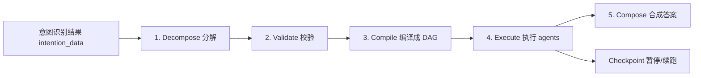

# 2026-08-08 意图识别与编排升级

## Summary

本次升级围绕「意图识别 → skill 调度 → 执行 → 答案合成」整条链路，把意图系统收敛为**声明式、可审计、有安全网**的架构：

- **意图 ↔ Skill 严格 1:1**：以 `hommey.yaml` 为唯一事实源，运行时动态构建意图目录，新增能力只需声明 skill，Python 一行不改。
- **规则层安全闸门**：LLM 识别出意图后，`IntentionAgent._should_call_intent` 做二次校验，决定每个意图是否真的触发 skill 调用（`should_call_skill`）。
- **未声明意图的确定性兜底**：yaml 里没有的意图一律不可调用，直接返回澄清/不支持文案，绝不误触发任何 skill。
- **编排语义由 DAG 管线接管**：`MultiIntentPipeline`（分解 → 校验 → 编译 → 执行 → 合成）成为所有 skill-backed 意图的统一入口，`OrchestrationAgent` 退化为可复用执行层。
- **答案合成不依赖"专门的聚合 agent"**：`AnswerComposer.compose()` 默认调用大模型（受严格约束的"答案编辑器"角色），并保留纯规则 `FallbackComposer` 兜底，保证任何情况下都有结构化输出。

## 背景

此前意图识别链路存在三类问题：

1. **意图词汇表与 skill 注册表容易漂移**：意图名散落在 guard / router / WebUI 多处维护，新增 skill 需要同步改多处 Python。
2. **LLM 输出缺少执行侧安全网**：模型可能识别出未声明意图或越界意图，若直接按 `agent_schedule` 派发，会调用到不存在的 agent 或误触发非差旅请求。
3. **编排职责不清晰**：`OrchestrationAgent` 承担了调度、暂停、聚合、记忆回写等全部语义，单类过重；多意图展开与跨轮续跑缺乏统一契约。

## 意图 ↔ Skill 1:1 声明式目录

`core/intent_catalog.py` 是唯一事实源，`SKILL_INTENTS` 由 `SkillLoader().load_definitions()` 从各 skill 的 `hommey.yaml` 运行时构建：

```python
SKILL_INTENTS = {
    definition.intent: {"skill": definition.name, ...}
    for definition in ordered
    if definition.intent
}
```

- 每个 skill 在 `hommey.yaml` 中声明**一个** `intent`（`Optional[str]`，非列表），正反映射均为 1:1（`intent_to_skill` / `skill_to_intent`）。
- 当前 9 个 skill 意图：`rag_knowledge`、`trip_compliance`、`chitchat`、`event_collection`、`mcp_tool`、`memory_query`、`itinerary_planning`、`preference`、`information_query`。
- 非 skill 意图仅 `unclear`、`unsupported` 两个，不调用任何 skill。
- `is_skill_intent(intent)` 即"意图是否在授权集合内"的判定；未声明 = 不可调用。
- 一致性由 `tests/test_intent_catalog.py` 兜底：意图目录必须覆盖所有声明了 Hommey intent 的 Skill。

> 注意：若两个 skill 声明同一 intent，字典 key 冲突，后加载覆盖前者——新增 skill 必须保证 `intent` 唯一。

## 规则层安全闸门：_should_call_intent

`agents/intention_agent.py` 的 `_should_call_intent()` 对 LLM 识别出的每个意图做执行侧裁决，返回 `should_call_skill`：

```python
if not is_skill_intent(intent_type):
    return False
if intent_type == "chitchat":
    return is_limited_chitchat(user_query) and passes_confidence_gate(intent_type, confidence)
if intent_type == "information_query":
    info_guard = can_call_information_query(user_query, confidence, conversation_context)
    return info_guard.intent == "information_query" and info_guard.should_call_skill
if not has_business_travel_context(user_query, conversation_context):
    return False
return passes_confidence_gate(intent_type, confidence)
```

各分支语义：

| 分支 | 判定 | 目的 |
|---|---|---|
| 非 skill 意图 | 直接 `False` | 未在 yaml 声明的意图一律不调用 |
| `chitchat` | `is_limited_chitchat` + 置信度门槛 | 只放行受限闲聊（问候/能力问答），禁止开放式聊天 |
| `information_query` | `can_call_information_query`（需明确查询对象 + 差旅上下文） | 信息查询必须是差旅任务的支撑，否则降级 `unclear` 并给出澄清话术 |
| 其余 skill 意图 | `has_business_travel_context` + 置信度门槛 | 拦截私人旅游/无关请求 |
| 兜底 | `passes_confidence_gate` | 意图级置信度门槛（`information_query` 更严） |

配套规则沉淀在 `core/intent_guard.py`（`guard_user_input` 前置检查）与 `core/guard_rules.py`（声明式关键词表），关键词数据收敛后新增"购买车票"类 skill 无需改 Python。

## 未声明意图的确定性兜底链路

LLM 即使编造出未声明意图，也会被规则层拦截，`should_call_skill=False`、`agent_schedule` 为空。下游两处短路：

- **`agents/orchestration_agent.py`**（`reply` 薄壳）：`routing.should_call_skill is False` → 返回 `status: "no_agents"`，文案取 `clarification` 或 `message_for_non_skill_intent(intent)`。
- **`webui_new/manager.py`**：`should_call_skill is False` → 直接返回澄清，不进 DAG 管线。

兜底文案按意图区分：

- `unsupported` → "这个问题不属于公司差旅规划或报销范围…"
- 其他未知意图 → "我还不太确定这是否与公司差旅有关。请补充出差目的地、日期…"

另有一层预防：意图 prompt 由 `build_intent_prompt_section()` 渲染，只列出 yaml 声明的意图 + `unclear`/`unsupported`，正常情况模型输出空间本就受限。

## 编排架构：MultiIntentPipeline 接管编排语义

所有 skill-backed 意图统一走 `core/orchestration/pipeline.py` 的 `MultiIntentPipeline`：



- **分解** `TaskDecomposer`：意图 → 用户语义任务（`IntentTask`），失败降级确定性 fallback。
- **校验** `TaskValidator`：校验任务是否 skill-backed、`should_call_skill` 等。
- **编译** `TaskGraphBuilder`：按 skill `execution` 声明展开为执行步骤（`ExecutionTask`，绑定 `agent_name`/`priority`/依赖），构建 DAG。
- **执行** `TaskExecutor`：按优先级分批并行，支持进度回调、重试、`abort/continue`、中途暂停。
- **合成** `AnswerComposer`：多 agent 结果 → 统一 `AnswerDocument`。
- **跨轮续跑** `run_resume`：检查点暂停后，下轮新消息增量补充事实，齐备则继续执行剩余步骤。

### OrchestrationAgent 的角色变化

`OrchestrationAgent` 不再是"编排大脑"，降级为**可复用执行层 + 工具层**，仍承担：

- `execute_task` → 作为 `MultiIntentPipeline` 的 `agent_runner`（管线每步实际执行靠它，含预算/重试/失败策略）。
- `prepare_context` → 生成 `base_context`（重写 query、key_entities、记忆注入、附件信息）。
- `record_task_results` → skill 平台运行统计。
- `reply` 薄壳 → 供脚本/测试等非管线入口使用（`should_call_skill=False` → `no_agents` 兜底）。

### 输入输出契约

`MultiIntentPipeline.run` 输入：`original_query`、`intention_data`（意图识别 JSON）、`base_context`、进度回调、可选 `task_query`。

输出 `PipelineOutput`：

| 字段 | 说明 |
|---|---|
| `tasks` | 语义任务列表 `IntentTask[]` |
| `execution_tasks` | 绑定 agent 的执行步骤 `ExecutionTask[]` |
| `results` | 各 agent 执行结果 `TaskResult[]`（status/data/evidence/duration） |
| `answer_document` | 合成后的最终回答 `AnswerDocument` |
| `paused` / `pause_info` / `presentation_document` | 暂停时现场信息（走 presentation 兜底） |

## 答案合成：无专门聚合 agent，默认调用大模型

合成答案**不是**专门的 AgentBase，而是 `AnswerComposer.compose()` 方法，默认**会调用大模型**：

- 模型来自 `COMPOSER_CONFIG`：独立配置则单独建 `composer_model`；与主 LLM 配置一致则复用同一模型；`COMPOSER_CONFIG.enabled=False` 时传 `None` 直接走规则兜底。
- LLM 扮演**受严格约束的"答案编辑器"**：system prompt 要求"只整理提供的任务结果，不得补充、推测或修改任何金额、日期、温度、比例和制度结论，只输出 JSON"。
- 输入：用户原始问题 + 任务列表 + 各 agent 结构化结果（facts）；输出统一答案卡片 `AnswerDocument`（`title/summary/sections/notices`）。
- **`sources` 与 `plain_text` 由系统生成**：LLM 输出中的这两个字段会被移除，防止模型编造来源。
- **`FallbackComposer` 纯规则兜底**：模型为 `None`、调用失败或校验不过时，确定性拼接 `AnswerDocument`，保证任何情况下都有结构化输出。

## 数据流总览

```
用户消息 → 预处理(attachment/规范化)
        → IntentionAgent 意图识别（guard 前置 + LLM + _should_call_intent 裁决）
        → should_call_skill=False → 澄清/不支持文案（不进编排）
        → MultiIntentPipeline（分解→校验→编译→执行→合成）
        → AnswerComposer（LLM 编辑器 + 规则兜底）
        → { response, answer_document, agents[] }
```

## 验证

- `tests/test_intent_catalog.py`：目录一致性（意图覆盖所有声明 intent 的 Skill）、1:1 映射不变量。
- `tests/test_intent_guard.py`：`guard_user_input`、`can_call_information_query`、`passes_confidence_gate`、寒暄路由、`should_call_skill` 判定。
- `tests/test_intent_core_helpers.py`：意图结果解析与校验。
- `tests/test_orchestration.py` / `test_skill_platform.py`：`OrchestrationAgent` 薄壳执行层。
- `tests/test_task_orchestration_v2.py` / `test_checkpoint_recovery.py`：DAG 管线与跨轮续跑。

## 影响与兼容性

- **新增能力**：只需在 `.agents/skills/<name>/hommey.yaml` 声明 `intent`、`agent_name`、`execution`，Python 无需改动。
- **意图命名**：与既有 skill 意图冲突会导致目录覆盖，需保持唯一。
- **`information_query`** 门槛更高（0.75 阈值 + 明确查询对象 + 差旅上下文），无差旅上下文的查询会被要求补充行程。
- **旧编排路径**：`OrchestrationAgent.reply` 保留兼容，脚本与测试仍可直连；生产 Web 入口默认走 DAG 管线（`ORCHESTRATION_V2_CONFIG.enabled`）。
