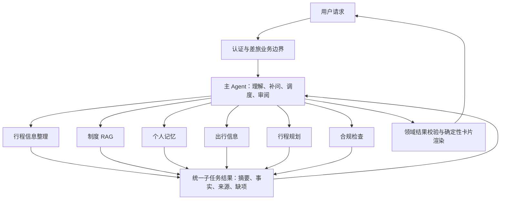

# Hommey 企业差旅 Agent 重构实施计划

日期：2026-09-08。代码基线：bbab50a 与当前工作区。状态：设计，未修改业务代码或数据库。

本版按最新要求修订：采用一个主 Agent 和六类专业子 Agent，将查询、总结、资料整理与方案分析下放。本阶段不设计模型能力不足时的引导/基础模式或模型档位切换；保留真实模型评测、业务边界、参数校验、超时、失败返回和恢复等正常执行保障。

此前“一个专业子 Agent”和“优先建设无模型替代流程”的建议已不适用。上一份记忆计划中可靠摘要、来源追溯、作用域隔离和上下文预算仍然沿用。

## 1. 总体架构

主 Agent（HommeyAgent）是唯一面向用户的对话与调度入口。它负责理解需求、维护本次需求完成情况、补问、决定委派对象、审阅结果和组织最终回复。

六类子 Agent 分担实质业务工作：

1. TripContextAgent：行程信息整理。
2. PolicyRAGAgent：内部差旅制度检索与总结。
3. MemoryAgent：个人差旅记忆查询与总结。
4. TravelInfoAgent：交通、天气、酒店候选与通勤信息查询整理。
5. TripPlannerAgent：行程方案设计与比较。
6. ComplianceAgent：方案合规检查与报销准备。

子 Agent 可以在自己的工具调用循环内多次查询、回读来源、过滤与总结。子 Agent 不得再次创建子 Agent，不直接相互发送消息，不直接面向用户发问。

“六类”是六种静态执行配置，不是六个常驻服务，也不是每轮必跑六次。共享同一运行时、模型客户端、数据库连接池；每次调用的消息与状态独立，闲置角色不产生模型调用。一个简单问题通常只需一类子 Agent。

主 Agent 可以根据结果改变下一步，不先生成一张由程序机械执行的业务 DAG。规划 Skill 中可以描述建议顺序，但不是必须每轮展开的节点模板。

## 2. 六类子 Agent 的职责与权限

| 子 Agent | 输入 | 实际工作 | 输出 | 能力边界 |
| --- | --- | --- | --- | --- |
| TripContextAgent | 当前任务、相关用户输入、当前行程、允许的附件片段 | 提取并合并出发地/日期/工作安排/临时约束，发现冲突和缺字段 | TripDraft、字段来源、变更候选、待补问题 | 不检索其他会话历史；不把偏好自动当成本次事实；不直接写库 |
| PolicyRAGAgent | 精确的差旅制度问题、企业身份对应的资料范围、必要职级/城市/日期 | 多次检索、原文回读、判断适用范围与版本、整理有据结论 | PolicyEvidence、结论摘要、引用、冲突与未知项 | 仅当前企业可访问的差旅制度；不使用公开搜索替代内部政策 |
| MemoryAgent | 明确的个人差旅记忆问题、允许检索的范围和过滤条件 | 查询本人偏好/历史行程/历史摘要，回读相关来源，区分计划与实际完成 | MemoryFindings、带时间与来源的事实、歧义、可供选择的历史目标 | 不推断稳定偏好、不猜测跨会话“上次”是哪次、不直接修改长期记忆 |
| TravelInfoAgent | 已确认出发地/目的地/日期/工作地点、用户要求的查询项目 | 调用车次、天气、地点和路线工具，去重、比较、按条件筛选与总结 | TravelOptions、真实车次/候选、时效与来源、不可用项目 | 不查用户未要求且与任务无关的信息；不编造价格/库存；不查询公司制度 |
| TripPlannerAgent | 当前行程、用户约束、相关政策证据与出行选项 | 形成日程、比较方案、安排工作时间和缓冲、提出必要修改 | TripPlanDraft、方案选择依据、约束满足情况、缺失证据 | 默认不自行再次检索；证据不足返回明确需求；不能把方案标成已完成出行 |
| ComplianceAgent | 待检查方案及其版本、适用制度证据、必要员工条件 | 校验标准适用性、金额/日期/交通等级等条件，整理报销材料要求 | ComplianceReport、逐项结论与引用、unknown、修改建议 | 不编造规则；不自行批准例外，不提交审批/报销，不替代人工权限 |

PolicyRAGAgent 负责“制度是什么、是否适用”；ComplianceAgent 负责“这份具体方案是否符合已有适用制度”。两者不各自重新检索一遍；合规发现资料不足时返回所需证据，由主 Agent 决定是否再次委派 RAG。

TripContextAgent 负责当前会话行程事实；MemoryAgent 负责历史与长期个人事实。规划 Agent 消费已经获得的资料，不再查一次天气或记忆。主 Agent 负责协调这些明确边界，避免每个子 Agent 都重复做一遍全流程。

复杂制度长文、个人历史回读、外部查询原始结果不直接进入主 Agent 上下文。

## 3. 主 Agent 的工作与工具面

主 Agent 可以：
- 读取按用途选择的 Skill。
- 委派注册角色，收取对应任务结果。
- 读取指定结果的必要部分，用于解决子 Agent 结论冲突。
- 提交经过验证的行程/偏好变更候选。
- 维护本次需求完成情况，询问用户缺失的信息。
- 选择已验证的结果与卡片，生成简短说明和最终回复。

主 Agent 不直接暴露制度检索、历史检索、天气、车次、通勤和酒店查询等底层工具。业务查询优先委派相应专业 Agent；例外的精确结果回读只作用于已授权子任务产物，不开放任意数据访问。

ContextBuilder 仍可自动装配当前会话摘要、当前行程核心字段、少量相关偏好，这属于运行时上下文供给，不等于让主 Agent 执行历史检索。

主 Agent 工具建议：
- read_skill：读取当前允许的业务指导。
- delegate：指定专业角色、具体问题、允许使用的事实与来源、预期产物。
- get_result：按结果 ID 读取必要字段或指定来源片段。
- apply_changes：提交子任务产出的变更候选 ID，由服务校验来源、权限与版本后事务写入。
- finish_response：提交选定的结构化结果/卡片引用与解释，交给输出校验与渲染。

用户补问可作为结构化回复类型返回，不需要让子 Agent持有对外通信工具。模型不能在这些工具参数中伪造 user_id、enterprise_id 或扩大权限。

## 4. 动态调度与子任务执行

一次主循环：
用户输入 → 当前会话上下文 → 主 Agent 决定委派/补问/回答 → 运行时验证委派 → 子 Agent 查询与分析 → 返回持久结果 → 主 Agent 评估是否足够。

主 Agent 可以在同一次响应中委派多个独立任务，由运行时有界并发执行。顺序由结果需求决定：规划需要资料，合规需要方案；没有资料时不能同时启动依赖这些资料的工作。

这不是把六个角色固定串成另一条 DAG。下面是不同请求的典型调用范围：

| 请求 | 通常涉及 |
| --- | --- |
| “公司出差去上海，住宿标准是多少？” | PolicyRAGAgent |
| “我上次出差住的什么酒店？” | MemoryAgent，目标不明确时由主 Agent 补问 |
| “这次出差返程改周五，查一下车次。” | TripContextAgent，然后 TravelInfoAgent |
| “按我之前的偏好规划下周上海出差。” | TripContextAgent、MemoryAgent，随后按需要查询制度/出行信息、规划与合规 |
| “检查这份现有方案是否超标。” | 已有有效证据时 ComplianceAgent；缺制度时先 PolicyRAGAgent |

首版委派深度为一，每请求同时最多三个子任务；总委派数和模型/外部调用数有根请求预算，不因角色增加而自动放大。预算值需根据完整规划样例实测，不能沿用“一两个子任务”的旧预算后导致六角色协作必然超限。

同类 Agent 可以有多个实例，例如分别查询上海和北京的制度；每个实例的查询、上下文和结果必须独立。相同查询条件、权限和数据版本的结果可以显式复用，城市/日期不同不能只按 Agent 名称复用。

子任务不得自由猜测下一个需要启动的角色。它可以返回缺少何种资料或建议下一步，由主 Agent 结合原始用户需求决定是否委派。

## 5. 子 Agent 上下文与返回协议

### 输入

每次子任务建立不可变 Scope：企业、用户、会话、根执行、子调用、任务版本。Scope 由服务器绑定，不接受模型自行指定身份。

输入只包含：
- 本子任务的明确目标、用户限制和完成标准。
- 与任务相关的结构化事实及来源。
- 必要的上游结果或其引用。
- 允许工具列表、预算、截止时间。
- 本角色的系统职责与按需加载的 Skill。

默认不复制主 Agent 的完整会话，不共享彼此的内部推理，不注入完整 MemoryManager/Repository/数据库连接。六类角色使用各自的工具允许列表；MemoryAgent 也只能经绑定当前用户的检索接口读取。

### 输出

统一子任务结果至少包括：
- status：success / partial / needs_input / unavailable / error。
- summary：供主 Agent 阅读的短摘要。
- data：TripDraft、PolicyEvidence、MemoryFindings、TravelOptions、TripPlanDraft 或 ComplianceReport。
- evidence_refs：服务器可验证的来源引用。
- missing_info / conflicts：缺失资料与冲突。
- proposed_changes：行程/偏好变更候选，可为空。
- result_id、scope、input_revision、observed_at：由运行时附加并验证。

主 Agent 默认只接收 summary、关键决策字段、缺项和结果引用。完整检索原文、候选列表和过程保存在子任务记录/来源存储里；前端卡片可以由渲染器直接读取结构化 data，避免主 Agent 再转写整份车次表。

短摘要不能省略决定后续行为的限制，例如制度只适用于某职级、价格只是参考值、车次查询失败、用户排除了天气、证据不足无法确认合规。这些同时作为结构字段返回，不依靠自由文本压缩。

## 6. Skill 与运行时的分工

Skill 是专业做事方法，不是强制执行节点列表。一个角色可以加载多个 Skill，同一个 Skill 可被主 Agent 与对应专业角色读取，Skill 与 Agent 不要求一一对应。

建议主 Agent 按需读取差旅规划、历史查询、行程修订等调度指导；专业 Agent 读取检索、证据筛选、方案比较、合规判断等角色相关指导。

业务服务负责不可放松的规则：
- 必填字段、日期一致性、来源归属与适用条件。
- 身份/资源权限、企业差旅用途、工具是否允许。
- 写入幂等、版本冲突、事务和状态变更。
- 真实车次/金额/天气字段与来源绑定。
- 合规材料不足必须输出 unknown。
- 规划只生成 planned 状态，真实 completed 需要用户明确表达。

子 Agent 返回候选变更，主 Agent 提交候选；主 Agent 同意不等于获得额外授权。服务仍检查用户原始来源和作用域。资料中的命令、助手猜测不能变成用户授权，也不能自动更新长期偏好。

后台会话压缩与记忆索引维护属于有界系统维护任务，不再增加一个常驻“记忆管家 Agent”。MemoryAgent 负责用户相关的记忆查询、整理与候选提议，不接管所有持久状态。

## 7. 企业差旅边界

仅服务公司差旅：事项收集、相关交通住宿与天气通勤、内部制度、合规、报销准备、本人差旅历史与偏好。

私人旅游、景点攻略、编程、论文、投资、娱乐陪聊和非差旅采购/医疗/人事业务均拒绝。包含“出差”不能使编程或其他域外任务获得权限。混合请求只处理可明确分离的差旅部分；用途不明确时由主 Agent 澄清。

保留简短问候、帮助、反馈与本人会话/记忆管理等必要产品交互。首版不执行订票、付款、抢票、审批/报销提交和代发消息；没有可靠供应商接口的实时机票、酒店库存等能力不承诺。

工具面不包含任意网页搜索、任意 URL 抓取、代码执行、任意 SQL 或通用 MCP 路由。外部数据查询通过已注册差旅工具，新增 Skill 不能自动扩展产品权限。

身份校验、请求用途、工具参数与输出范围均需要检查；不能只要求模型在 prompt 中自觉拒绝。未经验证的模型自由输出不直接流给前端。

首版一部署一企业，使用管理员邀请/审核的员工成员关系和固定制度集合绑定；多企业共享部署待完整 tenant/ACL/缓存/附件/检索隔离实现后再开放。当前仓库已有用户身份检查，但不能据此宣称完整多企业隔离已经具备。

## 8. 正常执行的可靠性保障

本阶段不设计 A/B/C 模型档位、无模型业务模式或弱模型替代架构。以下仍是当前主/子 Agent 路径的必要保障：

- 原生工具调用完整接收后校验，禁止从散文或半截流式 JSON 中猜测执行命令。
- 参数错误返回结构化错误，允许有限修正；不能无上限循环。
- 每请求与每子任务都有超时、调用和上下文预算；子任务消费根预算。
- 外部工具失败返回 unavailable/partial；主 Agent 提供已有有效结果或说明缺项，不编造成功。
- 子任务 needs_input 由主 Agent 汇总后补问，避免六个角色分别向用户提问。
- 所有写入先验证来源、Scope 和 revision，以事务和稳定幂等键提交。
- 用户取消后停止后续调用；旧子任务迟到结果不能覆盖已改日期或已取消状态。
- 进程重启复用已持久化且仍有效的结果；不重跑全部成功调用。
- 无制度证据不得确定宣称合规；数字出现在原文中不代表与当前条件匹配。
- 保留真实模型测试验证委派、使用工具、修订、来源理解和范围约束；未通过上线标准不能发布。

这是一套受控执行路径，不是重新加回固定业务 DAG。

## 9. 记忆与持久执行

保留 PostgreSQL 的消息、偏好、当前行程和历史；Redis 只缓存可重建内容。统一 ContextBuilder 为主 Agent 和每个子任务构建不同视图。

修复既有摘要问题：普通请求未接入当前会话摘要、生成失败提前推进水位、上一段排序错误。只有成功提交才推进连续覆盖范围；失败可补齐，摘要不重复存整份 prompt 和聊天。

主会话持久保存用户消息、最终回复和必要工作状态。子任务执行过程单独保存，设保留期；主会话引用子任务 ID 和短结果，不灌入所有检索噪声。

复用上一版精简执行记录：
- assistant_runs：请求、身份、engine_version、需求完成情况、状态、revision/generation、租约、最终答案引用。
- assistant_calls：父子关系、专业角色/工具、输入版本、参数、幂等键、状态、尝试次数、结果/来源、租约、错误。

调用执行前登记，结果提交后再交给父任务。数据写入与对应成功标记同事务提交；未知执行结果必须可表达，不能把所有超时视为未执行。

用户切换会话不自动继承另一行程；当前会话 ID 不因空闲十分钟隐式改变。历史查询和“按上次安排”由 MemoryAgent 返回有来源候选，主 Agent 必要时要求选定，再将确定的历史事实交给 TripContextAgent。

Token 预算包含主/子系统指令、Skill、工具 schema、附件、历史和工具结果。摘要、结果投影与压缩必须保留未完成事项、约束、来源可信度和时效边界。

## 10. 技术与仓库映射

保持 Python asyncio、FastAPI、现有 NDJSON、PostgreSQL、Redis、RAG/pgvector、交通地图服务和卡片。暂不更换基础设施，不新增微服务或独立队列平台。

复用 AgentScope 模型适配器，但新的业务代码通过小型 ModelClient 接口与统一执行器调用模型。六类子 Agent 是不同 system prompt、工具白名单、输入/输出 schema 和预算的 profile，使用同一套可观测循环；不复制六套运行框架。

| 现有模块 | 改造 |
| --- | --- |
| agents/intention_agent.py | 理解能力迁入主 Agent；退出独立 intents/groups 协议 |
| core/orchestration 的 decomposer/graph_builder/validator | 旧执行退出后删除；有效字段和权限规则迁入服务 |
| pipeline/executor/turn_resolver | 由主 Agent 循环、受控委派和精简执行记录替代 |
| agents/lazy_agent_registry.py | 静态专业 profile 注册，取消完整 MemoryManager 注入 |
| .agents/skills/event-collection | 演进为 TripContextAgent 的专业能力，修复默认今天 |
| .agents/skills/ask-question 与 rag/ | 形成 PolicyRAGAgent，保留检索后端与来源能力 |
| .agents/skills/memory-query 与 context/ | 形成 MemoryAgent，先过滤检索再总结，支持来源回读 |
| query-info/train-query/place-query | 后端整合到 TravelInfoAgent 工具集，避免重复查同一能力 |
| plan-trip | TripPlannerAgent 消费已取得的材料，返回方案草案 |
| check-trip-compliance | ComplianceAgent 消费特定版本方案与政策证据 |
| preference | 并入记忆/事实变更候选处理和受控写入，不新增独立偏好 Agent |
| core/presentation/ | 继续确定性卡片渲染，改为消费领域结果与来源 ID |
| webui_new/manager.py | 收缩为会话入口、执行生命周期与流式适配 |
| hommey.yaml | 删除固定 execution/priority/pause Agent 编排定义；保留必要元数据 |
| .github/workflows/deploy.yml | 测试阻断、固定镜像、readiness/业务探针、灰度与回滚 |

## 11. 实施阶段

工期需要按六类角色重新评估；初步按单人 20～28 个开发工作日，另留观察时间。当前不建设上一版的引导模式，其时间用于专业角色边界、来源合同和协作测试。

1. 范围与契约（2 天）：固定企业差旅边界、六角色工具/输入/输出合同、委派协议、真实模型与业务样例。
2. 业务底座与执行器（4～5 天）：封装现有工具、修正日期/状态/身份问题，统一 Scope、预算、调用记录、事务幂等。
3. 主 Agent + RAG/Memory 闭环（4～5 天）：优先打通用户最关心的检索与总结委派、来源回读和短结果汇报；接入当前会话摘要。
4. 其余四类专业角色（4～6 天）：事项整理、出行信息、规划、合规；保持共享执行框架，通过输入和权限明确分工。
5. 全链路与故障验证（4～6 天）：长对话、并发委派、多城市、多需求、修改与取消、崩溃恢复、域外拒绝、结果来源和前端回归。
6. 灰度与旧架构退出（2～4 天）：新执行固定新引擎，旧 Run 用旧路径收尾；完成回滚演练后清理兼容代码。

旧消息和业务事实不重复迁移；旧 DAG JSON 不强制转为新调用日志。影子对比不重复产生写入或外部副作用。出现严重故障停止新引擎入口，保留执行证据并对账；不在运行中把新旧引擎互换后整轮重跑。

## 12. 核心验收场景

- 简单制度问题只调用 RAG，简单记忆问题只调用 Memory，不绕完整规划链。
- 主 Agent 不执行原始制度检索、个人历史扫描或天气/车次查询。
- RAG 返回可回读来源，Memory 不把 planned/legacy_unknown 行程说成实际去过。
- 同类子 Agent 并发处理上海和北京，结果和政策适用条件不串。
- 子任务短摘要包含关键未知/限制，完整卡片由结果引用生成，主 Agent 无须改写事实表。
- 用户指定“不查天气”，TravelInfoAgent 不查询天气，其他角色不擅自补做。
- 修改返程日期，只重查受影响的信息、修订方案与必要合规项，不重跑全部角色。
- 专业 Agent 缺资料由主 Agent 决定补查或补问，不能递归创建 Agent。
- 一个子任务失败时，其他独立有效结果仍可交付；不能虚构缺失结果。
- 子任务取消、超时、进程重启、陈旧租约、重复提交不导致重复写入或旧数据覆盖。
- 主/子输入、工具和输出均守企业差旅边界；有“出差”前缀的编程/投资请求仍被拒绝。
- 实际模型多轮协作、引用、指代和工具协议经评测，不能仅以 JSON 合法或 HTTP 成功判断可上线。

任何跨用户/企业泄漏、未授权操作、虚构关键事实、重复写入、取消后继续有效写入、无证据确定合规、已删除记忆复活均为上线阻断项。合法任务成功率和域外拒绝率需要同时评测，不能通过全部拒绝来满足边界指标。

本次修订仅更新设计文档，没有改代码或重新运行测试。上一版记录的 64 项本地测试通过是旧架构基线，不能据此宣称六类子 Agent 新架构已经验证。
