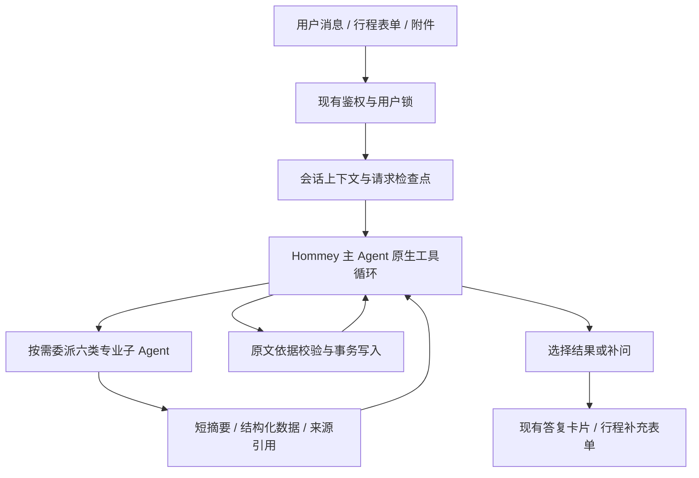

# 企业差旅主 Agent 改造：实现与回滚

本次在 `codex/enterprise-travel-agent` 分支实现。原始代码基线为
`87674841963f6a0c6ef53d0a60ead06afe6e83ca`，另保留分支
`codex/rollback-before-agent-rebuild`。设计文档检查点为 `9131513`。删除旧执行链之前的检查点为
`codex/checkpoint-before-single-runtime`（`6165ce1`）。2026-09-09 起只保留 Supervisor 执行链。

## 实际执行流程



子 Agent 是同一个运行器下的六种叶子角色，不是六个常驻服务：

| 角色 | 工作 | 可调用业务工具 |
| --- | --- | --- |
| trip_context | 整理当前行程、提出字段变更及缺项 | 无；只能读取对应 Skill 和报告 |
| policy_rag | 查询制度、回读原文、总结并保留依据 | search_policy、read_source |
| memory | 本人差旅记录/偏好查询总结、显式偏好变更提案 | search_memory、read_source |
| travel_info | 真实车次、天气、工作地点附近酒店、通勤查询总结 | search_trains、get_weather、find_hotels、search_commute、read_source |
| trip_planner | 使用明确传入的资料规划行程 | 无；依赖主 Agent 传入的专业结果 |
| compliance | 对传入方案和制度进行检查，缺证据返回 unknown | 无；依赖主 Agent 传入的专业结果 |

主 Agent 可委派、读 Skill、读/丢弃结果、提交变更、完成或补问。
不直接拥有 RAG、记忆检索或外部数据工具。工具表是实际权限边界，Skill
只能补充业务方法，不能授予工具权限。没有加入低能力模型的备用架构。

## 上下文与执行边界

- 主 Agent：本轮请求、当前会话最近 8 条消息、同会话最近 2 个已有摘要段、
  当前活动行程，以及每类专业角色最近的简短工作摘要。历史事实需要 memory 查询。
- 子 Agent：本轮请求、明确委派任务、当前行程、明确选择的依赖结果。
  不继承主 Agent 对话、兄弟子 Agent 日志、其他用户资料，也不能创建子 Agent。
- 来源注册表按子任务隔离。只能回读自己查询到的或被显式作为依赖传入的来源。
  主 Agent 的普通读取只拿结构化结果，不拿原始来源正文。
- 已删除读取时自动生成长期摘要的模型路径；使用已有摘要和有界工作摘要。
  更久的原始对话由 memory 按关键词检索。没有新建向量化个人记忆服务。
- 同轮最多并行 3 个独立子任务；默认最多委派 12 次、主循环 14 轮、每个子循环 6 轮。
  总请求沿用 240 秒超时，子任务默认 90 秒、业务工具 35 秒。
  单个 Agent 消息上下文最多 80,000 字符，请求检查点最多 1,000,000 字符。
- 子 Agent 的查询失败会作为不可用结果交还主 Agent；主 Agent 可继续交付已完成部分。
  格式不合规会得到工具错误反馈；预算耗尽停止，不切换模型或另起备用流程。

## 写入、恢复和业务边界

- 身份由已鉴权网页实例提供，模型不能传 user_id/session_id/SQL/任意 URL。
- 仅允许行程字段和固定差旅偏好字段写入；新值必须对应本轮用户原文。
  日期和天数另做确定性校验。不再默认“今天出发”。
- 新行程与取消行程需要明确的用户表达；新行程不沿用旧字段。
  形成方案不会把行程标记为真实出行完成。新历史记录区分 planned/cancelled，
  旧 trip_history 按 legacy_unknown 读取，不能据此声称用户实际去过。
- 数据库事务同时保存业务变更和操作回执；同一操作重放返回原回执。
  行程版本改变后，旧结果不能作为新方案输入；动态出行来源超过 15 分钟要求重查。
- PostgreSQL 检查点保存原生工具调用前后状态，支持同一请求 ID 在中断边界恢复，
  完成请求重放原答复。已有后续消息时，旧的未完成请求不能再次接管。
  新 owner 会阻止失效 worker 提交写入。取消轮询支持跨 worker，并取消子协程。
- 检查点按现有记忆规则脱敏，默认保留 14 天；该用户下次进入新引擎时清理过期检查点。
  会话删除/清空同步清理派生检查点、计划记录和活动行程。
- 仅服务企业差旅。保留前置领域规则，并限制主/子 Agent 工具权限。
  没有通用浏览、任意 MCP、Shell、SQL、预订、付款、审批提交或发送消息工具。
  模型文本理解仍依赖实际模型，需要真实请求验证，不能把规则和烟测解释为零错误保证。

## 兼容范围

沿用 Python/FastAPI、AgentScope 的 OpenAI 兼容模型适配器、PostgreSQL、Redis，
以及现有 RAG、12306、高德服务和前端 DTO。没有新增第三方依赖或部署服务。

`0022_supervisor_runs.sql` 创建 `supervisor_runs` 和 `supervisor_trip_records`。
`0023_retire_dag_runs.sql` 将旧 DAG 未结束任务标为 ABANDONED，保留快照供审计；
现有消息、偏好和活动行程保留，新消息统一进入 Supervisor。旧 DAG Python 执行器、
意图 Agent、动态注册器、Composer、memory hooks 和引擎开关均已删除。
偏好继续写现有宽表与 EAV 回滚镜像，活动行程保持旧引擎可读。

运行入口要求 PostgreSQL；文件/内存存储类仅用于独立存储测试，不能作为聊天引擎。
RAG 目前使用本部署固定企业知识库；不声称支持多个企业共享集合的租户隔离。
网页请求“增强检索”时会明确展示实际使用标准检索；当前专业工具尚未接入 HyDE。
酒店为附近 POI 与参考消费，12306 当前适配器不提供真实票价，也不执行交易。

## Skill 与评估

Skill 仅包含业务指南和展示元数据。工具白名单在 `agent_runtime/profiles.py` 中，
输入/输出契约在 `contracts.py` 和 `services.py` 中；不存在 YAML 生成 DAG 或动态导入
`script/agent.py`。管理员页面只读，已删除无实际效力的启停、执行图和旧执行轨迹界面。
离线评估从同一请求的专业结果采集角色、摘要与制度证据，不参与业务调度，也不能写业务数据。

## 启用和回滚

本次只修改代码分支，没有替换生产服务。部署前在测试环境验证所配模型的原生工具调用、
企业知识库、12306/高德服务；备份数据库后再使用现有启动迁移机制和 Docker 构建流程。

不再有运行时引擎切换。回滚要使用 Git 检查点并重建所有 Web worker：

```powershell
# 保留当前工作区改动后，再选择一个检查点；不要执行 reset --hard。
git switch codex/checkpoint-before-single-runtime
# 或回到整个改造之前：git switch codex/rollback-before-agent-rebuild
docker compose --env-file .env -f docker/docker-compose.yml up -d --build hommey
```

代码回滚不会自动恢复数据库。不要删除新表或反向执行迁移：0023 已终止的旧 DAG 任务
不会因切分支重新激活，需要重新提交业务需求；保存的行程和偏好仍然存在。
旧版本不能执行 Supervisor 检查点。若需回退业务数据，应另用部署前备份和写入回执处理。
回滚点用于代码恢复，不表示两套流程可互相转换。

## 本次简单测试（2026-09-09）

最终合并回归 107 项通过、1 项跳过，包含 Web API 错误/会话/表单契约。
全测试目录收集通过（417 项），仅表示导入和发现正常，不代表运行了全部集成测试。
覆盖六角色完整模拟行程、并行隔离、来源验证、日期与偏好写入、断点恢复、取消、
领域拒绝、单一运行工厂、Skill 无执行入口、评估采集、模型配置及数据服务适配器。
管理员页面 JavaScript 通过 `node --check`。

跳过的是依赖旧版 TXT 语料文件名的 RAG golden 校准：仓库现有语料已经替换，不能把
它冒充原校准集，也未为通过测试调整生产证据阈值。新语料检索质量需要另行校准。

当前 Docker 引擎未启动，未重新执行 PostgreSQL 烟测，0023 迁移也未在实际数据库应用。
此前阶段曾验证过 0022 的事务与恢复，但这不等同于本轮数据库验证。
未调用真实商业模型、企业知识库、高德或 12306，未做压力测试。

```powershell
# 仅给离线测试使用内存 RAG，避免导入服务器时连接本机数据库。
$env:HOMMEY_RAG_VECTOR_BACKEND = 'memory'
.venv\Scripts\python.exe -m pytest tests/test_single_runtime.py tests/test_supervisor_runtime.py tests/test_runtime_thinking.py tests/test_train_query_backend.py tests/test_intent_guard.py tests/test_memory_p0.py tests/test_place_information.py tests/test_rag_hyde_mode.py tests/test_rag_phase4_evidence.py tests/test_evaluation.py tests/test_llm_response_helpers.py tests/test_execution_budget.py tests/test_webui_error_responses.py -q
.venv\Scripts\python.exe -m pytest tests --collect-only -q

# 数据库验证必须在独立测试库配置 HOMMEY_TEST_POSTGRES_DSN 后执行。
.venv\Scripts\python.exe -m pytest tests/test_supervisor_postgres.py -q
```
