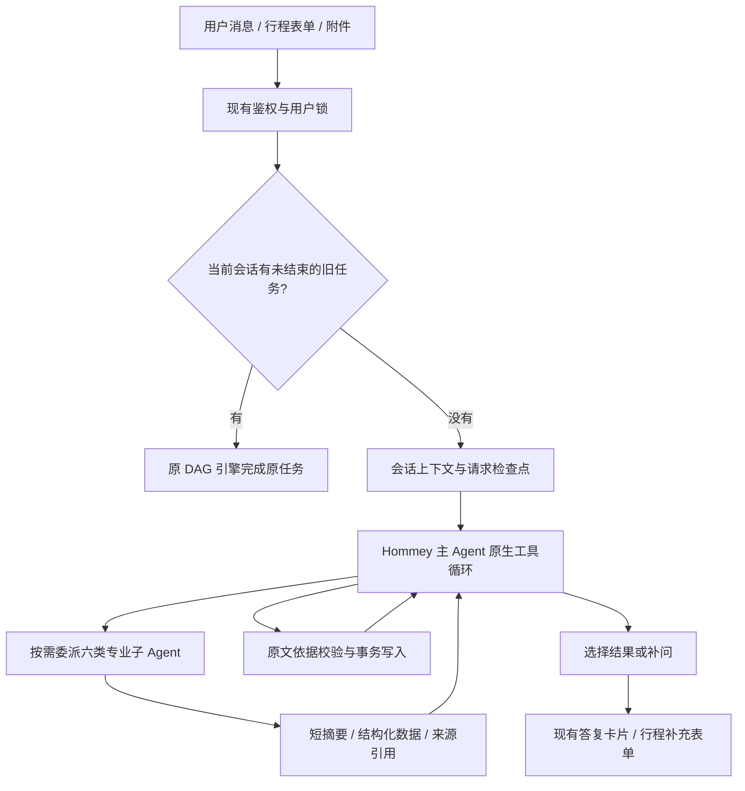

# 企业差旅主 Agent 改造：实现与回滚

本次在 `codex/enterprise-travel-agent` 分支实现。原始代码基线为
`87674841963f6a0c6ef53d0a60ead06afe6e83ca`，另保留分支
`codex/rollback-before-agent-rebuild`。设计文档检查点为 `9131513`。

## 实际执行流程



子 Agent 是同一个运行器下的六种叶子角色，不是六个常驻服务：

| 角色 | 工作 | 可调用业务工具 |
| --- | --- | --- |
| trip_context | 整理当前行程、提出字段变更及缺项 | 无；只能读取对应 Skill 和报告 |
| policy_rag | 查询制度、回读原文、总结并保留依据 | search_policy、read_source |
| memory | 本人差旅记录/偏好查询总结、显式偏好变更提案 | search_memory、read_source |
| travel_info | 真实车次、天气、工作地点附近酒店、通勤查询总结 | search_trains、get_weather、find_hotels、search_commute、read_source |
| trip_planner | 使用明确传入的资料规划行程 | 无；依赖主 Agent 传入的专业结果 |
| compliance | 对传入方案和制度进行检查，缺证据返回 unknown | 无；依赖主 Agent 传入的专业结果 |

主 Agent 可委派、读 Skill、读/丢弃结果、提交变更、完成或补问。
不直接拥有 RAG、记忆检索或外部数据工具。工具表是实际权限边界，Skill
只能补充业务方法，不能授予工具权限。没有加入低能力模型的备用架构。

## 上下文与执行边界

- 主 Agent：本轮请求、当前会话最近 8 条消息、同会话最近 2 个已有摘要段、
  当前活动行程，以及每类专业角色最近的简短工作摘要。历史事实需要 memory 查询。
- 子 Agent：本轮请求、明确委派任务、当前行程、明确选择的依赖结果。
  不继承主 Agent 对话、兄弟子 Agent 日志、其他用户资料，也不能创建子 Agent。
- 来源注册表按子任务隔离。只能回读自己查询到的或被显式作为依赖传入的来源。
  主 Agent 的普通读取只拿结构化结果，不拿原始来源正文。
- 本次不调用旧的“读取时自动推进水位”的会话摘要生成路径；使用已有摘要和有界工作摘要。
  更久的原始对话由 memory 按关键词检索。没有新建向量化个人记忆服务。
- 同轮最多并行 3 个独立子任务；默认最多委派 12 次、主循环 14 轮、每个子循环 6 轮。
  总请求沿用 240 秒超时，子任务默认 90 秒、业务工具 35 秒。
  单个 Agent 消息上下文最多 80,000 字符，请求检查点最多 1,000,000 字符。
- 子 Agent 的查询失败会作为不可用结果交还主 Agent；主 Agent 可继续交付已完成部分。
  格式不合规会得到工具错误反馈；预算耗尽停止，不切换模型或另起备用流程。

## 写入、恢复和业务边界

- 身份由已鉴权网页实例提供，模型不能传 user_id/session_id/SQL/任意 URL。
- 仅允许行程字段和固定差旅偏好字段写入；新值必须对应本轮用户原文。
  日期和天数另做确定性校验。不再默认“今天出发”。
- 新行程与取消行程需要明确的用户表达；新行程不沿用旧字段。
  形成方案不会把行程标记为真实出行完成。新历史记录区分 planned/cancelled，
  旧 trip_history 按 legacy_unknown 读取，不能据此声称用户实际去过。
- 数据库事务同时保存业务变更和操作回执；同一操作重放返回原回执。
  行程版本改变后，旧结果不能作为新方案输入；动态出行来源超过 15 分钟要求重查。
- PostgreSQL 检查点保存原生工具调用前后状态，支持同一请求 ID 在中断边界恢复，
  完成请求重放原答复。已有后续消息时，旧的未完成请求不能再次接管。
  新 owner 会阻止失效 worker 提交写入。取消轮询支持跨 worker，并取消子协程。
- 检查点按现有记忆规则脱敏，默认保留 14 天；该用户下次进入新引擎时清理过期检查点。
  会话删除/清空同步清理派生检查点、计划记录和活动行程。
- 仅服务企业差旅。保留前置领域规则，并限制主/子 Agent 工具权限。
  没有通用浏览、任意 MCP、Shell、SQL、预订、付款、审批提交或发送消息工具。
  模型文本理解仍依赖实际模型，需要真实请求验证，不能把规则和烟测解释为零错误保证。

## 兼容范围

沿用 Python/FastAPI、AgentScope 的 OpenAI 兼容模型适配器、PostgreSQL、Redis，
以及现有 RAG、12306、高德服务和前端 DTO。没有新增第三方依赖或部署服务。

新增 `0022_supervisor_runs.sql` 仅创建 `supervisor_runs` 和
`supervisor_trip_records` 及索引；旧 DAG 表、历史和业务工具都保留。
偏好继续写现有宽表与 EAV 回滚镜像，活动行程保持旧引擎可读。

新引擎要求 PostgreSQL。文件记忆开发模式须显式选 `legacy`，不会静默切换引擎。
RAG 目前使用本部署固定企业知识库；不声称支持多个企业共享集合的租户隔离。
网页的“增强检索”在新引擎下会明确展示使用标准检索；原增强检索流程仍在旧引擎中。
酒店为附近 POI 与参考消费，12306 当前适配器不提供真实票价，也不执行交易。

## 启用和回滚

代码默认 `HOMMEY_AGENT_ENGINE=supervisor`。先在测试部署验证模型原生工具调用、
企业知识库、12306/高德配置；再构建运行镜像。生产数据库迁移由原启动机制应用。
本次工作只修改并提交分支，没有替换运行中的生产服务。

功能回滚：把根目录 `.env` 中这一行设为：

```dotenv
HOMMEY_AGENT_ENGINE=legacy
```

然后重新创建所有 Web worker，让配置一致。若使用仓库 Docker Compose：

```powershell
docker compose --env-file .env -f docker/docker-compose.yml up -d --force-recreate hommey
```

若还需回到改造前代码，在保留其他工作区改动后切换检查点分支并重新构建：

```powershell
git switch codex/rollback-before-agent-rebuild
docker compose --env-file .env -f docker/docker-compose.yml up -d --build hommey
```

不需要删除新增表，也不要用 `reset --hard` 或反向删除迁移恢复代码。
引擎/代码回滚不会撤销已经保存的用户偏好或行程变更；上线前按现有流程备份数据库，
确需回退业务数据时根据备份与请求回执单独处理。旧引擎不能执行新引擎检查点，
切回新引擎后才可继续该检查点；两种检查点不互相翻译。

## 本次简单测试

32 项通过，1 项按原测试条件跳过。包括六角色完整模拟行程、并行隔离、来源校验、
日期/偏好写入校验、中断恢复、取消、领域拒绝、网页入口旧任务固定、卡片持久化、
JSON 检查点脱敏，以及现有预算/模型配置/行程表单/异步门面轻量回归。

另在专门启动的临时 PostgreSQL 测试容器中实际应用迁移，验证事务写入、
幂等回执、版本冲突、旧 owner 失效、后续消息保护和会话删除。测试后移除该容器。
未调用真实商业模型、真实企业知识库、高德或 12306；未做压力测试。

```powershell
# 离线关键流程
.venv\Scripts\python.exe -m pytest tests/test_supervisor_runtime.py -q

# PostgreSQL 烟测：HOMMEY_TEST_POSTGRES_DSN 必须指向独立测试库
.venv\Scripts\python.exe -m pytest tests/test_supervisor_postgres.py -q
```
