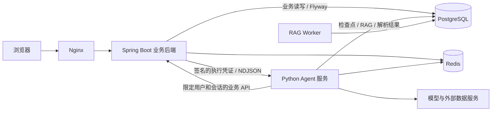

# Spring 业务后端 + Python AI 服务

本分支将确定性的业务操作放在 Spring Boot，将 Agent、RAG、附件解析和 AI 数据处理保留在 Python。浏览器只访问 Spring；Python 是内部能力服务。当前提供独立的新库开发部署，不自动迁移旧环境的数据。



## 职责和约定

| 能力 | 负责服务 |
| --- | --- |
| 登录、注册、验证码、邀请码、用户权限 | Spring Security + Spring 业务服务 |
| 个人资料、会话、消息、附件绑定、偏好、行程 | Spring Service / Repository |
| 数据库结构版本 | Flyway，只有 Spring 启动执行 |
| Agent 编排、模型调用、执行检查点和取消 | Python `agent_runtime` |
| RAG、知识库解析、图片/语音/文件处理 | Python 与独立 RAG worker |
| 静态页面、已有 HTTP 路径和 NDJSON 事件 | Spring 入口，尽量保持前端兼容 |

采用按业务分包的 `Controller → Service → Repository`。Spring MVC 处理业务 HTTP，WebClient 访问内部 AI 服务；没有引入注册中心、配置中心、消息队列或自研框架。当前采用一个 PostgreSQL 实例、分表归属和独立账号，保留检查点与业务提交之间的取消栅栏；它不是完全拆库的微服务体系。

浏览器 access token 的 audience 是 `hommey-api`。Spring 验证用户和会话后签发短期 RS256 执行凭证，限定 `user / session / request`，audience 是 `hommey-agent` 与 `hommey-business`。只有 Spring 持有私钥。Python 不接收公开登录 token，模型输入不包含执行凭证；回调 Spring 时仍检查用户归属。

业务变更在 Spring 的单个数据库事务内完成：执行状态/owner 检查、当前行程版本校验、行程和偏好写入、幂等回执写入。网络丢失后重试相同操作不会重复写入；输入改变会得到冲突。Python 使用 `hommey_ai` 账号，不能修改用户、资料、会话、消息、偏好、行程和业务回执；仅能读取检查点/评估需要的会话与消息，写入 AI 归属表。共享数据库账号不是多租户数据库隔离，租户归属由服务 API 与查询条件控制。

## 分支与旧版本

改造分支为 `codex/spring-python-backend`，基于 `d711abb`。原工作目录 `D:\Hommey` 保留在 `codex/restore-readme-badges`，其中原有 README 未提交修改没有带入或覆盖。

当前改造目录：

```text
C:\Users\Administrator\.codex\worktrees\spring-python-backend\Hommey
```

在 VS Code 中打开这个目录进行新架构开发。旧目录和旧 Compose 继续用于原版本。新部署使用项目名 `hommey-engineering` 与独立命名数据卷，不能把旧数据库卷接到新 Compose。

## 一键启动开发部署

需要 Docker Desktop，以及 Python（创建开发配置时用到 cryptography，包含在 `PyJWT[crypto]` 依赖中）。所有命令在改造目录执行：

```powershell
python -m venv .venv
.\.venv\Scripts\python.exe -m pip install -r requirements.txt -c requirements.lock
.\.venv\Scripts\python.exe scripts/prepare_engineering.py
# 编辑生成的 .env.engineering，填写模型、embedding、地图等需要的服务配置
docker compose --env-file .env.engineering -f docker/docker-compose.engineering.yml up -d --build
docker compose --env-file .env.engineering -f docker/docker-compose.engineering.yml ps
```

入口为 <http://localhost:8088>。Spring 调试端口为 `127.0.0.1:8080`，新 PostgreSQL 为 `127.0.0.1:15432`，新 Redis 为 `127.0.0.1:56380`。Python 服务不发布宿主机端口。已有 8000、8001、5432、6379、56379 服务不会被替换。

`prepare_engineering.py` 生成随机的独立数据库密码、验证码签名密钥和 RSA 密钥对，保留已有配置；`.env.engineering` 与 `.secrets` 不提交，也不复制进镜像。镜像只在运行时挂载密钥。不要删除或重新生成现有私钥来修复普通启动错误，那会使已签发的登录凭证失效。

模型与 embedding API key 没有自动复制。缺少时业务服务仍可启动，AI `/readyz` 会报告依赖未就绪，聊天/知识检索需填写后再验证。注册邮件需 `HOMMEY_RESEND_API_KEY`、可用的发件地址和邀请码。邀请码可在隔离开发库中使用现有脚本生成：

```powershell
# 仅指向新开发库；不要沿用旧环境的 DSN
$env:HOMMEY_POSTGRES_DSN='postgresql://hommey:<PG_PASSWORD>@127.0.0.1:15432/hommey'
$env:HOMMEY_SCHEMA_OWNER='spring'
python scripts/create_invites.py --count 1
```

如果调整数据库密码，已有数据卷中的角色密码不会自动跟随 `.env` 改变；需要显式修改角色密码。生产数据库密码若包含 URI 特殊字符，DSN 必须正确 URL 编码。准备脚本生成的十六进制密码可直接使用。

图片理解、语音转写、扫描文档 OCR 通过示例环境中的 `HOMMEY_VISION_*`、`HOMMEY_ASR_*`、`HOMMEY_OCR_*` 开关与 key 单独启用。RAG 扫描页还需 `HOMMEY_RAG_OCR_ENABLED=true`。

## VS Code 本机调试

安装仓库推荐的 Java Extension Pack、Spring Boot Extension Pack、Python 扩展，无需 IDEA，也无需全局 Maven。Java 项目使用 Maven Wrapper。

先启动依赖：

```powershell
docker compose --env-file .env.engineering -f docker/docker-compose.engineering.yml up -d postgres redis
.\scripts\start-backend.ps1
# 另一个终端，先选择本项目 Python 解释器
python scripts/run_ai_service.py
```

也可以使用 `.vscode/launch.json` 中的两个调试配置。Java 必须使用 JDK 21，而不是系统 `java` 命令目前指向的 Java 8；启动脚本只调整当前进程的 JAVA_HOME/PATH。当前机器已有 Microsoft JDK 21.0.6，但其 NIO 回环连接在这台 Windows 环境中报错；Java 网络集成测试改为 Linux/Temurin 21 容器执行。若本机启动也遇到 `Unable to establish loopback connection`，使用完整 Docker 部署，或更新本机 JDK 21 后再调试，不在应用中添加操作系统特例。

本机 Python 使用 `127.0.0.1:18001`，启动脚本从 `.env.engineering` 配置新 AI 数据库账号、Redis 与内部接口，禁止使用原版本 `.env` 的业务账号作为 AI 数据库账号。环境变量优先于文件，调试前清理终端中残留的旧 DSN。

## 检查与排错

```powershell
cd backend
.\mvnw.cmd verify
cd ..
python -m pytest -q tests/test_business_boundary.py
docker compose --env-file .env.engineering -f docker/docker-compose.engineering.yml logs --tail 100 backend agent rag-worker
```

Java 集成测试使用 Testcontainers 的独立 PostgreSQL，验证鉴权、数据归属、参数约束、幂等、事务版本、AI 数据库权限和 NDJSON 首块转发。Python 测试验证执行凭证和上下文隔离，并保留现有 Agent 回归测试。GitHub Actions 在 PR 与改造分支运行这些检查，不部署服务器。

`requirements.lock` 固定本次 Linux/Python 3.11 验证的依赖版本，镜像与 CI 同时使用 requirements 和约束文件，避免构建时无意升级模型 SDK。升级依赖需重新解析并通过测试。Java 格式由 Spotless / Google Java Format 检查；新 Python 服务使用 Black。开发格式工具通过 `pip install -r requirements-dev.txt` 安装。

新栈启动后还可运行真实 Spring/PostgreSQL 与 Python Supervisor 的联调测试，使用测试模型验证业务提交与重复执行，不调用外部模型：

```powershell
$env:HOMMEY_SPLIT_INTEGRATION='1'
python -m pytest -q tests/test_spring_agent_integration.py
Remove-Item Env:HOMMEY_SPLIT_INTEGRATION
```

该测试只连接新栈的 `localhost:15432` 与 `localhost:8080`，创建并清理自己的临时用户数据，不复用旧库。

业务健康检查为内部 `/actuator/health`；Python `/healthz` 表示进程可用，`/readyz` 检查模型配置、数据库、Redis 与检索依赖。Nginx 禁止公开 `/internal/` 和 `/actuator/`，关闭响应缓冲以保留流式输出。外部服务失败映射到稳定错误响应，日志以请求 ID 关联，不打印令牌与验证码。

## 本次验证记录

- Linux / Java 21：`mvn spotless:apply verify` 通过，13 项集成测试，真实 PostgreSQL 与 Redis。注册链路使用本地邮件替身，未发送真实邮件。
- Linux / Python 3.11：201 项保留的 Agent、前端契约与服务边界测试通过，1 项需单独数据库环境的测试跳过。Windows 符号链接测试的环境限制已在 Linux 核验。
- 新 Compose：Spring、AI、RAG worker、PostgreSQL、Redis、Nginx 均启动；入口与健康检查可访问。
- 两项跨语言联调：生产 runtime 工厂与 Supervisor 使用测试模型完成行程提交和重复执行；Spring 转发真实 Python 附件上传/解析/下载，消息绑定正确，普通用户不能刷新知识库。

这些验证不代替真实模型、邮件服务与旧数据迁移的正式验收；当前本地 AI key 和邮件配置为空。

架构约定依据 [Spring Boot 项目组织](https://docs.spring.io/spring-boot/3.5/reference/using/structuring-your-code.html)、[Spring Security JWT](https://docs.spring.io/spring-security/reference/servlet/oauth2/resource-server/jwt.html) 和 [WebClient](https://docs.spring.io/spring-framework/reference/web/webflux-webclient.html)。

## 旧数据迁移和生产切换

V1 只初始化空库，`baseline-on-migrate=false` 防止默默接管已有库。当前不自动迁移旧数据库，也不修改现有服务器部署工作流。正式切换前：

1. 备份旧 PostgreSQL、上传文件、知识源文件与必要配置；把备份恢复到独立演练库，核对现有 26 个迁移和约束。
2. 验证演练库与 V1 基线一致后，使用 Flyway 的显式 `baseline` 将既有结构标记为版本 1，再执行后续迁移。禁止直接执行空库 V1 或默认开启自动 baseline。
3. 对比用户、资料、会话、消息、附件、偏好和行程的数据数量与归属；以真实模型、注册邮件、附件上传、断线重试、多会话并发完成验收。
4. 在生产使用 TLS 入口、受保护的数据库/Redis 网络、密钥管理和备份。移除 Compose 中开发调试用的数据库、Redis、Spring 宿主机端口；只有入口对外。数据库超级用户仅用于初始化/迁移，生产需进一步拆分迁移账号与运行账号。
5. 保留旧服务与迁移前备份，短暂冻结业务写入完成最终同步后切换入口。新架构已产生写入后，不能仅切回旧容器就认为完成数据回滚，需按备份/增量同步策略恢复业务数据。

开发回滚只需停止新栈并继续使用旧目录：

```powershell
docker compose --env-file .env.engineering -f docker/docker-compose.engineering.yml down
```

`down` 保留新栈数据卷；不要随手添加 `-v`。无需删除改造分支、覆盖旧目录或重置旧数据库。
